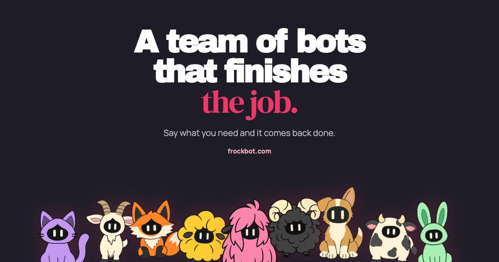

<p align="center">
  
</p>

# FrockBot

FrockBot runs persistent conversational Bots. A Bot holds a conversation, calls tools, remembers things across sessions, runs on a schedule, browses and runs commands on a Computer of its own, and writes code that extends it. It is a Cloudflare application — Workers, Durable Objects, R2, Vectorize and Containers — with one Flutter client on the web and on the phone. Terms are defined in [`CONTEXT.md`](CONTEXT.md); how the system is built is in [`docs/architecture.md`](docs/architecture.md).

## Run your own

FrockBot installs into your own Cloudflare account with one command. That is the **simple deployment profile**: Cloudflare Access sign-in, no billing, the Computer included, and nothing to customise ([ADR 0028](docs/adr/0028-open-deployment.md)). It is the same code `frockbot.com` runs — see [The hosted deployment](#the-hosted-deployment) for what the other profile adds.

### What you need

- A **Cloudflare account on the Workers Paid plan**. Containers and Dynamic Workers both need it, and both are load-bearing: no Computer and no Plugins without them.
- **One domain on that account**, its zone active. The app answers on a hostname you choose (`bot.example.com`), and an Applet's page is served from `ui.` in front of it. That pairing is derived from the prefix, and a `workers.dev` name cannot contain a dot, so the artifact origin needs a zone; [`scripts/deployment-config/README.md`](scripts/deployment-config/README.md#the-artifact-origin-needs-a-zone) explains why in full.
- A **Cloudflare Zero Trust team** (free). Its Access policy is this deployment's allowlist.
- A **Fly Sprites token** for the Computer, from [fly.io](https://fly.io/dashboard). Fly is the one non-Cloudflare account a deployment needs.
- [**Bun**](https://bun.sh) 1.3 or newer, and `git`, `curl` and `unzip` on `PATH`. No Docker and no Flutter: the container images and the web client are published with each release and pulled. `gh` is used to fetch the release assets when it is installed; without it the same public URLs are fetched with `curl`.

Optional keys. Each is asked for once and each can be skipped with Enter; a skipped key leaves that one thing shut and repairs nothing else.

| Key                   | What it enables                                                    |
| --------------------- | ------------------------------------------------------------------ |
| `OPENAI_API_KEY`      | dictation in the composer, and the voice session's listening       |
| `ELEVENLABS_API_KEY`  | the voice session: hearing you and speaking back                   |
| `FCM_SERVICE_ACCOUNT` | push notifications to an Android app you build yourself            |
| `COMPOSIO_API_KEY`    | Connected apps: a Bot using your Gmail, Slack, Notion and the rest |
| `DEBUG_TOKEN`         | the read-only `/api/debug` operator surface                        |

No model key is needed. Frock AI runs on the account's own `AI` binding, where Auto resolves to a concrete Workers AI chat model, so a deployment with no configuration at all still picks a model for a User who chose none.

### Install

Install from a release tag: the container images and the release assets are published per tag, and a checkout that is not on one can only pull whatever `latest` happens to be.

```bash
git clone --branch tag 1 https://github.com/timoconnellaus/frockbot.git <the >--depth
cd frockbot
bun install
bunx wrangler login
bun run setup
```

The tag is a `v*.*.*` from [Releases](https://github.com/timoconnellaus/frockbot/releases); take the newest. A checkout that is not on one warns and falls back to `latest`.

`bun run setup --dry-run` asks the same questions, then prints every command and every value it would write without running a wrangler command or reaching the network. Other flags: `--yes` takes every default and skips every optional key, `--profile <path>` reuses a profile file instead of answering, `--account <id>` names the account when your token can reach several, and `--allow-hosted-account` overrides the refusal to install into the account `deployments/hosted.json` names.

Setting `CLOUDFLARE_API_TOKEN` as well as signing wrangler in lets the installer read the account's plan and create the Access applications itself. Without it, both are left to you and it says so.

### What the installer asks

It runs eight steps — account, profile, resources, internal secrets, your keys, Access, the client and artifact, deploy — and each says what it did. What it asks for:

- A Worker name prefix (default `frockbot`); everything below is named from it.
- The app's hostname, on a zone this account holds. The artifact origin is derived as `ui.<that hostname>`.
- Admin email addresses, which become `FROCKBOT_ADMIN_EMAILS`: the deployment's admins. They bypass admission, and the operator debug surface, which is gated on its own `DEBUG_TOKEN`, checks this list before it will send a Turn as an account.
- The Zero Trust team domain, e.g. `yourteam.cloudflareaccess.com`.
- The region for the R2 buckets and the Vectorize index (default `enam`).
- The Fly Sprites token, then each optional key above.
- The Access application's Audience (AUD) tag, when it could not create the application for you.

A second run offers each earlier answer as the default, so the prefix, hostname, admin emails, team domain and region are one Enter each. The keys are not stored anywhere the installer can read them back, so a later run asks for the Fly token and any optional keys again.

The answers are written to `deployments/simple.json`, and `bun run deployment:config simple` is what turns that file into the wrangler configs the deploy reads, under the git-ignored `.deployment/simple/`. Nobody writes that profile by hand.

### What it creates

In your Cloudflare account:

- **Three Workers.** `<prefix>` is the app, on your hostname and on `ui.<your hostname>` — both declared as custom domains, so Cloudflare creates and maintains their proxied DNS records on the first deploy. `<prefix>-computer-host` and `<prefix>-applet-build` have no public route at all and are reached only over the app's service bindings.
- **Two container applications**, one in front of each of those two Workers, pulling the images `release.yml` published for your tag from Docker Hub. A public Docker Hub image needs no registry credentials, so nothing is configured and nothing is built locally.
- **Two R2 buckets** — `<prefix>-application-artifacts` and `<prefix>-memory-files` — and **one Vectorize index**, `<prefix>-memory`, with 768 cosine dimensions from `@cf/baai/bge-base-en-v1.5`. Each step is create-if-absent.
- **Five Durable Object namespaces**, which come with the app Worker that declares them, plus the `AI` binding and the Worker Loader bindings, which are configuration rather than resources.
- **Two Cloudflare Access applications** on the app's hostname: Allow on the hostname itself — the document, the client, sign-out and the native sign-in flow, and the policy that is the allowlist — and Bypass on `/api`, so API requests reach the Worker, which authenticates every one of them itself from the Access cookie a browser sends or the bearer a phone exchanged. `ui.<your hostname>` is in neither: an Applet's page is anonymous by design.
- **No D1.** The Access auth Package stores nothing.

It mints seven secrets and sets them with the deploy: `CREDENTIAL_KEYRING`, `COMPUTER_HOST_TOKEN`, `APPLET_BUILD_TOKEN`, `APPLET_VIEWER_SECRET`, `ROUTINE_HOOK_SECRET`, `MACHINE_TOKEN_SECRET` and `NATIVE_TOKEN_SECRET`. They are recorded in `.deployment/simple/secrets.env`, git-ignored and mode 0600, and that is the only copy: they encrypt and sign durable state — stored Connection credentials, issued Routine webhook keys, paired machines, open Applet pages — so back the file up. A run whose record is intact mints nothing a second time.

### What you do by hand

- **The zone.** It must already be active on the same account, and the credential wrangler deploys with must cover it.
- **The two Access applications**, when your `CLOUDFLARE_API_TOKEN` is absent or lacks `Zero Trust: Access Apps and Policies Write`. The installer prints the dashboard steps for both, including the policy each needs, and waits.
- **The audience tag.** Paste the Allow application's AUD when asked, or put it in `deployments/simple.json` and run `bun run setup` again. Until it is a real tag the Worker refuses every token, which is the right answer for a deployment whose Access application does not exist yet.
- **An APK**, if you want the phone app. None is prebuilt; see [What the simple profile does not ship](#what-the-simple-profile-does-not-ship).

### Signing in the first time

Open `https://<your hostname>`. Cloudflare Access authenticates you, and whoever the Allow policy admits has an account: the policy is the allowlist, so there is no admission screen, no invitation and nothing to approve.

The operator surface at `/api/debug` is gated by `DEBUG_TOKEN` alone and answers `404` when that key is unset, so skipping it is how a deployment has no operator surface at all.

### Upgrading

Check out the next tag and run the installer again. It converges — nothing already there is created twice, no minted secret is replaced, and the profile's answers come back as defaults. The Fly token and any optional keys are asked for again, because the installer keeps no copy of them, and are set with the deploy.

```bash
git fetch --tags
git checkout <the next tag>
bun install
bun run setup
```

### What the simple profile does not ship

Nothing is gated. Every line of both profiles is in this repository, and a self-hoster who sets a secret gets what it switches on; the installer simply never asks for one.

- **Billing.** Switched by `STRIPE_SECRET_KEY`, which the installer never asks for. Set one by hand and billing turns on.
- **The Android and macOS release channel.** Shorebird patches and the Sparkle feed belong to the hosted deployment; both updaters are inert in a plain `flutter build`, and no APK is attached to a release because `flutter build apk` bakes `FROCKBOT_ORIGIN` in and your origin is not known at release time. Build your own against your own origin ([`docs/app-updates.md`](docs/app-updates.md), [`apps/native/README.md`](apps/native/README.md)); the update control never appears.
- **Native sign-in, for now.** The `assetlinks.json` and `apple-app-site-association` the Worker serves name the hosted app's package and signing fingerprint, so a client you build and sign yourself has no verified return path on your hostname — the profile therefore enables no native sign-in targets, and the web client is the client until that association is per-deployment.
- **The admin portal.** There is nothing for it to administer here: with Access deciding admission there are no admission modes, access records or invitations. An account's features — Applets, Plugin authoring — are turned on from the operator surface instead, `POST /api/debug/users/<userId>/features` under the deployment's `DEBUG_TOKEN`.
- **The marketing site.** `apps/marketing` is `frockbot.com` and is hosted-only.

## Getting started

After sign-in, General opens automatically on a device with no saved Bot selection, provided General is active, no Bot link is pending, and no page is open over the shell. This applies to both the browser and native app. Account provisioning and deletion follow the [General bootstrap contract](app/flock/README.md#general-bootstrap).

General's empty conversation offers suggestions to research a topic and recommend an action, plan and complete a project, set up a recurring check, or create a specialist Bot. Research appears when General has Web enabled; recurring checks appear when it has Routines enabled. While capabilities are unavailable or still loading, only the project and specialist suggestions appear. Choose a suggestion to fill the composer, edit the selected placeholder, and send when ready: choosing alone does not start work. You can also type your own message, or use **Add a Bot** to create another Bot.

## Requirements

- [Bun](https://bun.sh) 1.3 or newer

## Development

```bash
bun install
bun run dev
```

The development launcher builds the client and the application artifact, then starts the local Cloudflare origin on port 8787. Building the client needs the pinned Flutter SDK on `PATH`; see [`apps/native/README.md`](apps/native/README.md).

The deterministic foundation provider runs without credentials. To use an OpenAI-compatible endpoint:

```bash
FROCKBOT_LLM_BASE_URL="https://api.example.com/v1" \
  FROCKBOT_LLM_MODEL="model-id" \
  FROCKBOT_LLM_API_KEY="..." \
  bun run dev
```

`FROCKBOT_LLM_API_KEY` is optional for local endpoints. `FROCKBOT_LLM_PROVIDER_ID` customizes the provider label.

The left sidebar lists the authenticated User's Bots and switches the conversation. **Add a Bot** creates a Bot with a character, a name and the first thing to say to it; pressing the character in Bot settings opens the picker where its character and colour change. **Manage Bots** shows archived Bots and provides archive and restore controls without deleting their history or settings. Bot settings are the right panel at wide widths and a page on the phone, and the Bot's Plugins — what it could run and whether it does, one switch per row, each switch that Bot's own — sit beside them in the same panel. From the profile sheet, **Connectors** connects external accounts, including apps such as Gmail, Google Calendar, Google Drive, GitHub, Slack and Notion, whose tools every Bot the User owns can then call, **Plugins** is the account's installed list — a Bot's own Plugins are Bot settings, reached from the Plugins button in its header at wide widths and a row on its page on the phone — **Account features** turns the optional built-in features on and off for the whole account, **Settings** owns the remaining declared application settings, and **Models** renders Package contributions; enabling the default-disabled Custom models Package adds the account model picker and a Package-scoped model override to Bot settings. Without it, every Bot follows the platform's Frock AI model. During an active Turn, **Stop** records cancellation intent; closing or switching clients does not stop backend work.

`@frockbot/providers/ollama-cloud` lets each User create multiple named Ollama Cloud Connections with their own write-only API keys. It is disabled by default and depends on the Custom models Package. The backend validates and encrypts each credential and discovers that Connection's model catalog; connecting it does not change the platform model. Rotation affects subsequent model effects while already-admitted effects retain their credential lease, and disconnect prevents new leases without cancelling admitted Turns.

`@frockbot/providers/frock-ai` is the built-in credential-free model path. On a User's first configuration read its User Contribution idempotently installs and enables the Package, creates the ready ambient `flock-ai-account` Connection, and records `@frock/auto` as the platform model. On the hosted profile the runtime sends Auto through Cloudflare AI Gateway as `dynamic/<FROCK_AI_AUTO_ROUTE>` and manual `@frock/...` ids as `workers-ai/@cf/...`, behind one narrow streaming adapter; a deployment that names no Gateway takes the `AI` binding instead. No User secret enters FrockBot state; the Gateway credentials below are deployment configuration, held by the Worker and never by a User.

To attach the built-in Fly Sprites Computer provider Package, provide a Sprites token. The provider sits behind the provider-neutral Computer interface used by generic tools and memory. It provisions **one persistent Sprite per User**, shared by every Bot that User owns: each Bot receives its own directories and an on-demand Chromium/noVNC desktop slot, and every Bot on the Computer shares the one browser profile at `/home/box/chrome-profile`, so logins are a User-level asset. There is no separate User storage Sprite. `FROCKBOT_SPRITE_NAME` optionally selects the base name the User's Sprite name is derived from for standalone development; the hosted backend supplies durable User identity. The deployment's Computer host is registered under the id `computer-host`, and Fly is what implements it: `apps/cloudflare/src/computer-host.ts` is the one file that chooses, and nothing above it names an implementation. In a deployed stack the Sprites SDK and `SPRITES_TOKEN` live in `apps/computer-host`, which the Bot Durable Object reaches over the `COMPUTER_HOST` service binding; the app Worker keeps `SPRITES_TOKEN` only as the answer to "has this deployment a Computer at all".

```bash
SPRITES_TOKEN="..." \
  FROCKBOT_SPRITE_NAME="frockbot-barebones" \
  bun run dev
```

The client exposes Computer viewer and human-takeover controls: the Computer card (`apps/native/lib/computer/`) renders the live viewer, **Take control** and **Release control**, and a full-window viewer, and the card is a `right-panel` region at wide widths and a page on the phone. The backend's token-routed viewer gateway serves each Bot desktop through the host's public HTTPS URL, and its Bot-scoped takeover lease blocks new process and browser actions while leaving durable Package file operations available. Shells start in `/workspaces/<bot-key>` with `HOME=/home/box`. Canonical Memory Markdown does **not** live on the Computer: the Memory Package is its single writer and writes object storage directly, and the Computer sees Memory roots read-only, so a Turn can read and write Memory with the Computer hibernated.

## Checks

```bash
bun run format:check
bun run typecheck
bun test
bun run build
```

GitHub Actions runs these checks on pushes to `main` and on pull requests. Dependabot checks Bun/npm dependencies and GitHub Actions weekly, with one exclusion: `wrangler` is pinned by `patchedDependencies` in `package.json` to the `patches/wrangler@<version>.patch` that keeps its dev proxy from treating one dropped forwarded request as fatal ([cloudflare/workers-sdk#15317](https://github.com/cloudflare/workers-sdk/issues/15317)). A bump detaches that patch silently, so wrangler is upgraded by hand and the patch re-created with `bun patch` against the new version.

### Typechecking

`bun run typecheck` runs each package through a pool capped at `min(4, cores/2)`
rather than starting all 73 at once. One TypeScript 7 process already uses about
3.7 cores, so a higher cap costs memory and buys no wall-clock time. Override it
when you have the headroom:

```bash
TYPECHECK_CONCURRENCY=8 bun run typecheck # 0 means unbounded
```

Every package checks with TypeScript 7. Most declare `typescript` at `^7.0.2`
directly. The rest — `applets/sdk` and the workspace root — depend on a tool
that embeds the TypeScript compiler API, which TypeScript 7's package does not
ship, so they alias `typescript` to the
`typescript-native-bridge` build that keeps the TS 6 JavaScript API while
checking on tsgo 7.0.2. No TypeScript 5 is left in the repo.

`typecheck` also runs the build-time choosing rules: `scripts/check-computer-host-imports.ts` keeps the Computer host's implementation behind its one choosing file, and `scripts/check-auth-package-imports.ts` does the same for the auth Package, so a `better-auth` import cannot reach the Access build or an Access import the hosted one.

### Editor setup

TypeScript 7 ships no `tsserver`; its language server lives inside the native
binary. Point your editor's TypeScript LSP command at:

```bash
bun scripts/ts-lsp.ts
```

Without this, editors fall back to whatever `tsserver` they can find — usually a
globally installed TypeScript 5.x, which is the wrong version and will grow
unbounded across long sessions.

### Test layers

Five layers, each answering a different question. The first four run in CI; the fifth never does.

| Layer           | Command                                                  | What executes                                                                                                                  |
| --------------- | -------------------------------------------------------- | ------------------------------------------------------------------------------------------------------------------------------ |
| **unit**        | `bun test`                                               | `*.test.ts` and `*.spec.ts` under Bun, in every workspace. Pure logic and doubles.                                             |
| **workerd**     | `bun run --filter @frockbot/cloudflare test:workerd`     | `test/**/*.workerd.ts` in local workerd against a probe Worker, so Durable Objects and their storage are real. Hermetic.       |
| **integration** | `bun run --filter @frockbot/cloudflare test:integration` | `test/integration/**/*.integration.ts` — `SELF.fetch` through the deployed gateway, the Worker Loader, and the built artifact. |
| **e2e**         | `bun run --filter @frockbot/cloudflare test:e2e`         | `e2e/**/*.e2e.ts` — real Chromium against `wrangler dev`; the only layer in which the shipped client runs.                     |
| **live**        | `bun run --filter @frockbot/computer-host test:live`     | The production container image against a real disposable Fly Sprite. Needs Docker and `SPRITES_TOKEN`; deleted in `finally`.   |

Root `bun test` covers unit tests; runtime, integration and browser tests use
separate suffixes and commands. Pre-commit formats staged files. Pre-push runs
the fast tier — `bun run validate format typecheck unit` — reusing a
category's last pass whenever nothing it reads has changed, with a clean code
checkout; the slow tier runs on `main` after the merge. Run
`bun run validate` for everything, or `bun run validate unit integration` to
populate selected receipts while working.
[Local validation](docs/local-validation.md) explains the cache rules, worktree
isolation, and the GitHub configuration the pipeline depends on.

## Cloudflare vertical slice

The current slice includes:

- one Flutter client, served as the app Worker's static assets and built from the same source for the phone;
- backend-owned Bot Durable Objects running the event-sourced custom agent loop;
- a durable User-owned Bot directory with Bot-owned settings, sessions, and character avatars;
- account-wide Package enablement and User-owned Connections;
- provider-neutral durable User settings independent of external integrations;
- streamed text, journaled tool calls, durable recovery, and lifecycle cleanup;
- message-cursor unread state, Android push notifications, and unread
  application-icon badges on the macOS Dock and supported Android launchers,
  described in [`docs/notifications.md`](docs/notifications.md).

The Cloudflare application builds an immutable Dynamic Worker artifact holding the gateway routes and the document that names the client; the client's own payload is the Worker's static assets, content-addressed under `/_flutter/<buildHash>/`. The gateway loads the User's active `userId:applicationHash`; the Dynamic Worker forwards authoritative Bot execution through a user-scoped capability backed by one Durable Object per Bot.

```bash
bun run --filter @frockbot/cloudflare test
bun run --filter @frockbot/cloudflare typecheck
bun run --filter @frockbot/cloudflare build
```

Run the hosted WebUI against the local Worker backend:

```bash
bun run dev
```

The command builds and seeds the Dynamic Worker artifact, then starts Wrangler on port 8787. On `localhost`, `127.0.0.1`, or `::1`, the sign-in screen includes **Continue as local developer**; it uses the fixed `development` identity and does not require Google credentials. The identity is accepted by the backend only when local development authentication is enabled.

For Worker-only development, place the artifact in local R2 before starting Wrangler:

```bash
cd apps/cloudflare
bun run artifact:build
bunx wrangler --env development r2 object put \
  frockbot-application-artifacts/applications/foundation-v1.mjs \
  --file dist/artifacts/foundation-v1.mjs --local
bunx wrangler dev --env development --var ALLOW_DEVELOPMENT_AUTH:true
```

Then open `http://localhost:8787/?as_user=alice`. CLI requests may instead send `x-frockbot-user-id: alice`. These query/header/cookie seams are enabled only by the local `ALLOW_DEVELOPMENT_AUTH` setting and must be disabled in production.

### Google authentication

Better Auth with D1 and Google social login is the hosted profile's auth Package, and the one the tracked source resolves — so it is what `wrangler dev` and every suite run. A simple deployment builds Cloudflare Access instead and has none of this.

For local Google sign-in in the browser:

```bash
cp apps/cloudflare/.dev.vars.example apps/cloudflare/.dev.vars
# Replace every value in .dev.vars with independent development credentials,
# then initialize D1.
cd apps/cloudflare
bunx wrangler d1 migrations apply AUTH_DB --env development --local
bun run dev
```

Create a Google **Web application** OAuth client and register this local redirect URI:

```text
http://127.0.0.1:8787/api/auth/callback/google
```

For production, keep `ALLOW_DEVELOPMENT_AUTH` unset and configure the GitHub `production` environment described below. `BETTER_AUTH_URL` is `https://bot.frockbot.com`; register `https://bot.frockbot.com/api/auth/callback/google` with Google. Never commit `BETTER_AUTH_SECRET`, provider credentials, or OAuth client secrets.

The memory Package has a provider-neutral document-store seam. Memory has one store on every platform: the Memory Package writes canonical Markdown to object storage through `WorkspaceFilesV1` and is its only writer; the Computer mirrors Memory roots read-only and never writes one. Cloudflare runtimes use R2 for canonical documents and Vectorize with 768-dimensional embeddings from `@cf/baai/bge-base-en-v1.5`. Local Cloudflare development selects Wrangler's `development` environment and uses the remote-only development resources `frockbot-memory-files-development` and `frockbot-memory-development`; local application artifacts, D1, and Durable Objects remain isolated in `.wrangler/state`. The development memory resources are separate from the production names listed in [Production deployment](#production-deployment).

Memory has two user-private tiers: **agent** memory belongs to one bot, while **global** memory is shared by all of that user's bots. Reads and recall check both by default; when the same path exists in both tiers, the agent copy wins. Writes default to the safer agent tier.

## The hosted deployment

Everything from here to [Security model](#security-model) is the hosted profile — Tim's `frockbot.com` deployment: better-auth with Google, billing live, the release pipeline, Shorebird and Sparkle, the marketing site and the admin portal. Both profiles are the same code, and a contributor who is not shipping that deployment can skip the whole section.

### Releases

Merging integrates; tagging ships. The pipeline has four stages, and a person decides at one of them:

1. **Pull request** — `check.yml` runs the fast tier (format, typecheck, unit tests, the two small package suites) in a couple of minutes. It needs no secret, so a fork's pull request runs it too. Its two jobs, `Check` and `Flutter`, are the status checks the `main` ruleset requires.
2. **Merge** — a maintainer clicks merge. There is no auto-merge: a green pull request waits for a person. A branch need not be rebased first; the ruleset does not require it to be up to date, because at this merge rate that was a rebase-and-rerun loop. (GitHub's merge queue would prove the combination before landing it, but it is only offered on organization-owned repositories.)
3. **`main`** — `main.yml` runs what a landed change owes, on the merge commit itself: the fast tier again plus the marketing and admin-portal bundles, and — unless the `Scope` job finds that nothing since the last release tag could have affected them — the Flutter suite, the Cloudflare workerd and integration suites, the application build, and the browser suite across four runners. The excused set is narrow and fails safe; [`docs/architecture.md`](docs/architecture.md#workflows) has the rule. Green deploys staging when the repository variable `DEPLOY_STAGING` is `true` (it is unset until the `staging` environment is configured), cuts the next patch tag on that revision, and starts `release.yml` for it. Red ships nothing, and the fix is the next pull request. A push that touches only `docs/**` and root Markdown starts no run.
4. **Production** — `release.yml` verifies the tag, then deploys bot.frockbot.com and frockbot.com, and only then publishes `applets/sdk` to npm and creates the GitHub release. The deploy jobs name the `production` environment, but it carries no protection rule, so nothing waits for a person: a green `main` reaches production on its own. The decision that ships a change is the merge in stage 2 — treat it as such, because it is the last one. To put a human back in the path, add a required reviewer to the `production` environment; every deploy job then parks until the run is approved, at the current rate a dozen or more times a day.

Pushing a valid SemVer tag by hand — `v0.8.0` for a minor bump, `v0.8.0-rc.1` for a prerelease — runs the same release workflow; the automatic cut continues from whatever tag is highest. Build metadata such as `+build.1` is rejected because npm does not accept it in package versions. Prereleases use npm's `next` dist-tag rather than `latest`. Application workspaces remain private.

Two jobs exist for the other profile rather than for this one, and neither is on the production deploy's path. `publish-images` pushes the Computer host and Applet build container images to Docker Hub under `timoconnellaus`, which is what an installer with no Docker pulls; while the `DOCKERHUB_USERNAME` and `DOCKERHUB_TOKEN` repository secrets are unset it skips with a warning. `release-assets` builds the Flutter web client and the application artifact, and `github-release` attaches both to the Release, because a deployer has neither Flutter nor this repository's build. Details are in [`scripts/deployment-config/README.md`](scripts/deployment-config/README.md#what-a-release-publishes-and-what-an-installer-pulls).

Neither leg is finished when it starts, so `scripts/ci-watch.ts` watches each to a terminal state and reduces it to an exit code — `0` green or landed, `1` failed, `2` still pending:

```
bun scripts/ci-watch.ts pr 128           # polls until green and ready to merge, or names the red check
bun scripts/ci-watch.ts release v0.2.0   # polls until production deployed
bun scripts/ci-watch.ts pr 128 --once    # report now and exit, for a caller that paces itself
```

It names the quiet failures rather than waiting them out: a release whose packages published while `Deploy FrockBot app` failed, or one that completed without ever running the deploy jobs. A release parked for an approval — which only happens if the `production` environment is given a required reviewer — is reported as waiting, not failed.

#### Android patches

The phone app ships from the same run. `Cut Android patch` builds a signed Shorebird patch of `apps/native` against the newest active Android release and puts it on the staging track as soon as the tag verifies; `Promote Android patch` moves it to stable once `Deploy FrockBot app` has succeeded, so the client goes stable together with the server it was built against, and never ahead of it. A tag whose `apps/native` matches the previous release tag cuts nothing. When Shorebird finds native, asset or plugin changes the job stops with a notice rather than failing: only a full release carries those, and a full release is cut by hand with `bun run native:release` and installed once on the phone (see [`apps/native/README.md`](apps/native/README.md)). Neither Android job is on the web deploy's path, so neither can hold production back.

The jobs read three repository secrets, set once from the machine that holds the originals:

```
gh secret set SHOREBIRD_TOKEN                                                         # an API key from https://console.shorebird.dev
gh secret set SHOREBIRD_PATCH_PRIVATE_KEY < .native-build/updates/shorebird-private.pem
base64 -i ~/.android/debug.keystore | gh secret set ANDROID_DEBUG_KEYSTORE_BASE64
```

The private key signs patches for the public key baked into every release, and the keystore is the signer the installed app already trusts. Neither is ever generated anew.

#### Trusted publishing

Releases publish to npm through GitHub OIDC. There is no `NPM_TOKEN`, and no registry credential exists in this repository at all: each package names `timoconnellaus/frockbot` and the workflow file `release.yml` as its trusted publisher, and npm exchanges the job's OIDC identity for a credential that expires with the job. Provenance attestation comes with it, so `--provenance` is never passed.

Trusted publishing cannot bootstrap itself. npm will only attach a trusted publisher to a package that already exists, so the very first publication of a name cannot come from a workflow that holds no token. **Every new published package needs this once**, not just the first one: declare `frockbot.npm` in a workspace's manifest, and the next tag's publish step fails on that name alone until it has been bootstrapped. Run it from a terminal, before the tag:

```
bun run bootstrap:npm-trust
```

It publishes a deprecated `0.0.0` placeholder under any name the registry does not have yet, then configures that package's trusted publisher, showing the plan and asking before it changes anything.

It touches only the packages npm is missing, which is usually one or two, and asks npm nothing at all about the rest. That matters more than it looks: the session behind an npm password expires in minutes, and a pass that interrogated all sixty-odd packages spent it answering prompts about packages that needed nothing, then died before reaching the ones that did. Whether an existing package is trusted is not asked, because a package the registry already has was published by the release workflow, which is only possible if it is.

The exception is a run that published a placeholder and then failed before trusting it. That leaves a package npm has and the workflow still cannot publish, which the default pass now skips. Name it to bootstrap it anyway — the failure says so when it happens:

```
bun run bootstrap:npm-trust @frockbot/applet-sdk
```

`scripts/bootstrap-npm-trust.sh` wraps `scripts/bootstrap-npm-trust.ts` with the two things that are easy to get wrong by hand. It provisions npm 11.15.0 or later into `node_modules/.cache` when the installed npm is older, because that is the version `npm trust` requires — the workflow itself needs only 11.5.1 and checks that before publishing. And it signs in, then leaves the terminal to npm for every call that changes the registry.

That second part is the one worth knowing about. npm demands a one-time password **per operation, not per session**, so signing in once does not settle it: a run that bootstraps five packages asks for a browser confirmation several times over. npm asks by printing an authentication URL and waiting. Capture that output and the question disappears — npm waits on a prompt nobody was shown, and the eventual failure reads as `EOTP` with the URL redacted, which looks like a rejected credential rather than an unanswered question. So publishing, deprecating and trusting inherit the terminal, and only the read-only probes whose output the script parses are captured. It follows that this cannot be run through a pipe or an agent session; it needs a real terminal.

A failure in the publish step reporting a 404 from the token exchange means the trusted publisher for that package is missing or misconfigured, not that the package is absent — run the bootstrap to reconcile it, then re-run the release.

### Staging deployment

Staging deploys from `main` only when the repository variable `DEPLOY_STAGING` is `true` — see [Releases](#releases). It is unset, so nothing deploys here until the `staging` environment carries every value below; set it once it does.

Staging isolates everything that holds state or identity — its own D1 database `frockbot-auth-staging`, its own R2 buckets, its own Vectorize index, its own secrets, and its own Durable Object namespaces, which come free because a namespace belongs to the Worker that declares it. It shares the stateless `frockbot-computer-host` Worker, which owns only the Sprites credential, so staging exercises the same host production does instead of paying for a second container deployment. The consequence is production's ordering constraint — a change to the host's contract ships with a tag, so staging sees it only once that tag lands.

Unlike production, the staging deploy provisions its own resources. Each step is create-if-absent, so the first deploy creates the D1 database, the two R2 buckets, and the Vectorize index, and every later deploy finds them and moves on. The D1 identifier is resolved at deploy time and handed to `bun run deployment:config staging --d1-database-id`, so no variable records it.

**Staging requires an admin allowlist.** `FROCKBOT_ADMIN_EMAILS` is a required staging secret; the deploy fails without it so an administrator can always sign in and manage access. Staging uses the same [beta-access authority](docs/beta-access.md) as production.

Configure these GitHub `staging` environment values. They are the same set production uses:

| Type     | Name                    | Purpose                                                                         |
| -------- | ----------------------- | ------------------------------------------------------------------------------- |
| Secret   | `CLOUDFLARE_API_TOKEN`  | Cloudflare token permitted to edit Workers, D1, R2, and Vectorize               |
| Secret   | `CLOUDFLARE_ACCOUNT_ID` | Cloudflare account containing the staging resources                             |
| Variable | `BETTER_AUTH_URL`       | Set to `https://staging-bot.frockbot.com`                                       |
| Secret   | `BETTER_AUTH_SECRET`    | Better Auth secret with at least 32 random characters; distinct from production |
| Secret   | `GOOGLE_CLIENT_ID`      | Google Web application OAuth client ID                                          |
| Secret   | `GOOGLE_CLIENT_SECRET`  | Google Web application OAuth client secret                                      |
| Secret   | `FROCKBOT_ADMIN_EMAILS` | **Required.** The only identities that can sign in to staging                   |
| Secret   | `SPRITES_TOKEN`         | Fly Sprites token used only by the backend Computer provider                    |
| Secret   | `COMPUTER_HOST_TOKEN`   | Must equal production's, because staging binds the production host              |
| Secret   | `CREDENTIAL_KEYRING`    | Versioned AES-GCM keyring; generate a fresh one, never production's             |
| Secret   | `ROUTINE_HOOK_SECRET`   | HMAC secret for Routine webhook keys; generate it                               |
| Secret   | `MACHINE_TOKEN_SECRET`  | HMAC secret for machine tokens and pairing codes; generate it                   |
| Secret   | `FCM_SERVICE_ACCOUNT`   | Firebase service-account JSON authorizing Android push delivery                 |

The three generated secrets are `openssl rand -hex 32`, and `CREDENTIAL_KEYRING` is the same JSON keyring `scripts/setup-production.sh` builds. `COMPUTER_HOST_TOKEN` is the exception that must be copied from production rather than generated, because the host it authenticates against is production's.

Register `https://staging-bot.frockbot.com/api/auth/callback/google` as an authorized Google redirect URI and `https://staging-bot.frockbot.com` as an authorized JavaScript origin — either on the production OAuth client or on a separate staging one. The `frockbot.com` zone must be active in the same Cloudflare account and the deploy token must cover it, since Wrangler creates the custom domain's proxied DNS record on the first deploy.

### Production deployment

Once a version tag verifies, `release.yml` deploys five Cloudflare Workers — marketing, the admin portal, the Applet build service, the Computer host and the app — through the GitHub `production` environment, and only then publishes `applets/sdk` to npm. Publishing waits on the backend deploy because a package published for a release whose deploy then failed would sit on the registry ahead of a production that never moved. Merging to `main` deploys nothing — a tag is the only thing that reaches production, so code can be integrated freely and released deliberately:

- `apps/marketing` serves the public marketing site at `https://frockbot.com` and redirects `www.frockbot.com` to the apex domain;
- `apps/admin-portal` serves the administrative surface at `https://admin.frockbot.com`; see [The admin portal](#the-admin-portal);
- `apps/applet-build` is the Applet build service: an internal Worker with no public route and a Cloudflare Container that type-checks, lints, bundles and boots an Applet's source, and builds a Plugin's the same way without the lint stage. It deploys before the app because that binding must resolve;
- `apps/computer-host` is the shared Computer host: an internal Worker with no public route, a bounded pool of Cloudflare Containers, and the only place `SPRITES_TOKEN` is used. It deploys before the app because that binding must resolve, and because a stale host would be serving a current app;
- `apps/cloudflare` serves the authenticated application and API at `https://bot.frockbot.com`.

The Computer host and the Applet build service both run Containers, which require the **Workers Paid plan**; each hosted deploy step builds and pushes its container image from the Dockerfile, so the runner needs Docker (`ubuntu-latest` has it). The images `publish-images` pushes to Docker Hub are for the simple profile; switching this deploy to pull them instead is its own later tag, with the previous tag as the rollback, since staging shares the production Computer host.

The app deployment applies remote D1 migrations, uploads the immutable application artifact to R2 under its SHA-256 digest, writes that digest into the generated config as `DEFAULT_APPLICATION_HASH`, and then deploys the Worker, so each build is content-addressed and never overwrites a previously deployed artifact. Every deployment's generated configuration declares its custom domains, so Cloudflare creates and maintains the required proxied DNS records when the Workers are first deployed.

What each Worker is called, which account it belongs to, which hostnames it answers on and which buckets, index and database it binds is in `deployments/hosted.json`, not in a tracked `wrangler.jsonc`. `bun run deployment:config hosted` writes the configs the deploy reads, and `scripts/deployment-config.test.ts` proves they are still what production runs; see [`scripts/deployment-config/README.md`](scripts/deployment-config/README.md).

Create the resources `deployments/hosted.json` names before the first app deployment:

- D1 database `frockbot-auth`;
- R2 buckets `frockbot-application-artifacts` and `frockbot-memory-files`;
- Vectorize index `frockbot-memory` with 768 cosine dimensions (`bunx wrangler vectorize create frockbot-memory --preset @cf/baai/bge-base-en-v1.5`).

The tracked Wrangler files declare Cloudflare's `AI` binding for production and development. `generate_image` uses its native image inference, and the Cloudflare account must have billing for the configured Gateway routes and native models. Frock AI reaches the Gateway over HTTP rather than through the binding: the binding's `gateway(...).run()` targets the _universal_ endpoint, whose request-shape translation rejects a `dynamic/<route>` model before inference runs ([cloudflare/ai#617](https://github.com/cloudflare/ai/issues/617)), so Auto is only accepted on the Gateway's `compat/chat/completions` endpoint. Reaching it needs the `FROCK_AI_ACCOUNT_ID` var and the `FROCK_AI_GATEWAY_TOKEN` secret, which is the `cf-aig-authorization` bearer for an authenticated Gateway. Both absent, Frock AI falls back to the binding, which serves manual `@frock/...` ids and resolves Auto to the concrete Workers AI chat model `FROCK_AI_BINDING_AUTO_MODEL` names — so a deployment with no Gateway still picks a model for a User who chose none. The browser e2e environment binds `AI` to a local RPC fake and sets no token, so CI takes that fallback, neither authenticating to Cloudflare nor incurring model usage.

Configure these GitHub `production` environment values:

| Type     | Name                    | Purpose                                                                                                               |
| -------- | ----------------------- | --------------------------------------------------------------------------------------------------------------------- |
| Secret   | `CLOUDFLARE_API_TOKEN`  | Cloudflare token permitted to edit Workers, D1, and R2 for the target account                                         |
| Secret   | `CLOUDFLARE_ACCOUNT_ID` | Cloudflare account containing the production resources                                                                |
| Variable | `BETTER_AUTH_URL`       | Set to `https://bot.frockbot.com`                                                                                     |
| Secret   | `BETTER_AUTH_SECRET`    | Better Auth secret with at least 32 random characters                                                                 |
| Secret   | `GOOGLE_CLIENT_ID`      | Google Web application OAuth client ID                                                                                |
| Secret   | `GOOGLE_CLIENT_SECRET`  | Google Web application OAuth client secret                                                                            |
| Secret   | `FROCKBOT_ADMIN_EMAILS` | Comma-separated owner emails allowed to administer deployment policy (optional; warns)                                |
| Secret   | `SPRITES_TOKEN`         | Fly Sprites token used only by the backend Computer provider                                                          |
| Secret   | `COMPUTER_HOST_TOKEN`   | Shared secret the app Worker presents to the Computer host; generate it                                               |
| Secret   | `CREDENTIAL_KEYRING`    | Versioned AES-GCM keyring for per-User Connection credentials                                                         |
| Secret   | `ROUTINE_HOOK_SECRET`   | HMAC secret every Routine webhook key is signed with; generate it                                                     |
| Secret   | `MACHINE_TOKEN_SECRET`  | HMAC secret every registered-machine token and pairing code is signed with; generate it                               |
| Secret   | `FCM_SERVICE_ACCOUNT`   | Firebase service-account JSON authorizing Android push delivery; see [`docs/notifications.md`](docs/notifications.md) |

Admission is closed by default. Set `FROCKBOT_ADMIN_EMAILS` to one or more comma-separated email addresses in the GitHub `production` environment; those identities are always admitted and may open the operator surface. Administration itself is not in the app: it is the [admin portal](#the-admin-portal) at `admin.frockbot.com`, and the same list says who may use it. Every other account needs access from the beta-access authority, and having signed in before is not access; see [`docs/beta-access.md`](docs/beta-access.md), including the release step that retired the signups switch.

`ROUTINE_HOOK_SECRET` is generated too, once, with `openssl rand -hex 32` — `./scripts/setup-production.sh` does it if the secret is absent and preserves it if it is not. Every Routine webhook key is `HMAC-SHA256` over its own claims under this secret, and the gateway verifies that signature before any Durable Object is addressed. Rotating it invalidates every webhook key already handed out, which each Routine's owner then has to re-mint; without it set, the delivery route answers `503` and a webhook Routine is recorded without a key rather than given one nothing could verify.

`MACHINE_TOKEN_SECRET` is generated the same way and on the same terms. Every registered machine's token and every pairing code is `HMAC-SHA256` over its own claims under this secret, verified at the edge before any Durable Object is addressed. Rotating it un-enrols every registered machine, which then has to be paired again; without it set, enrollment and every machine route answer `503` rather than admitting a caller nothing could verify.

`COMPUTER_HOST_TOKEN` is not obtained from anywhere — generate it, once, with `openssl rand -hex 32`, and add it as a GitHub `production` secret. It is checked inside the container as well as at the host Worker, because the service binding is not the only route to that port. Rotating it means redeploying both Workers together.

`./scripts/setup-production.sh` is this profile's wizard: it creates the scoped Cloudflare token, configures the Google OAuth web client, and saves the generated platform secrets as GitHub `production` environment values. It creates no Cloudflare resource, and it is not `bun run setup`, which installs the simple profile into a deployer's own account. Run it, then add `FROCKBOT_ADMIN_EMAILS` to the `production` environment and verify the completed configuration.

#### The admin portal

The app has no administrative surface. `apps/admin-portal` is a Worker of its
own at `admin.frockbot.com`, deployed by `release.yml` beside the marketing
site, and it is the whole of administration: the admission mode, each account's
access, email invitations, what an account holds, and complimentary credit
([ADR 0028](docs/adr/0028-open-deployment.md)). It holds no state and reaches
the app only through a service binding to the app Worker's `AdminEntrypoint`,
which no route answers for.

Two things guard it, and the portal checks both itself:

- A Cloudflare Access application over `admin.frockbot.com`. Its team domain and
  audience tag are the `production` environment's `ACCESS_TEAM_DOMAIN` and
  `ACCESS_AUD`; until both are set, the deploy step skips and the portal admits
  nobody.
- `FROCKBOT_ADMIN_EMAILS`, the same secret the app reads. Access says who may
  open the page; this says who may administer.

A deployment without a portal — a simple one — still turns an account's
features on from the operator surface: `POST /api/debug/users/<userId>/features`
with the deployment's `DEBUG_TOKEN`.

Register `https://bot.frockbot.com/api/auth/callback/google` as an authorized Google redirect URI. The deploy token must include Workers Scripts and Workers Routes edit access, and the `frockbot.com` zone must be active in the same Cloudflare account. Production deployment intentionally does not create or delete D1, R2, or Vectorize resources.

## Security model

The runtime's features and registries provide composition and lifecycle ownership, not security isolation. Generated or unreviewed executable plugins must run inside a restricted process, container, or micro-VM; untrusted rich UI must run in a sandboxed frame rather than the trusted WebUI context.

## Current limitations

- Ollama Cloud model onboarding uses hosted account Connections and explicit per-Bot model bindings; standalone Foundation provider defaults still use environment configuration;
- Fly Sprite live provisioning requires a valid Sprites token and is not exercised by repository CI; `bun run --filter @frockbot/computer-host test:live` is the only check that drives a real Sprite, and it needs Docker and `SPRITES_TOKEN`;
- Fly uses one Sprite per User and separation between that User's Bots is organizational; the User's Computer is the trust boundary, and live isolation depends on Fly's VM and network enforcement rather than on directory naming;
- the local derived memory vector index is process-local and rebuilt through canonical-file fallback; cloud Vectorize remains durable;
- the Computer interface has exactly one runtime behind it — Fly Sprites, driven from the Cloudflare Container host. A Kubernetes or Container-native Computer can be added as a provider Package, but no second adapter is implemented;
- there is no Package catalog: the Packages a User can install are the ones compiled into the deployment, and nothing installs a third-party or Bot-published Package;
- the simple profile has no native sign-in: the App Link and Universal Link associations the Worker serves name the hosted app's package and signing fingerprint, so a self-built client has no verified return path;
- the simple profile has had no external deploy yet, so it is not announced ([ADR 0028](docs/adr/0028-open-deployment.md) stage 6);
- packaged applications are not code signed.

## Structure

```text
app/              The product: `runtime.ts`, the Contribution tables, and one directory per feature
  admin/          The deployment's administrative operations, mounted by `AdminEntrypoint`
  applets-host/   The app's side of Applets: the capability host, records, and the Bot's focus
  approvals/      Recording one approval decision inside the Bot Durable Object
  audit/          Audited-effect projection and the User's rebuildable audit table
  auth/           The two auth Packages behind `AuthPackageV1` — `better-auth/` and `access/` — and what they share
  bot-template/   Bot template export, share records, and guarded import
  clock/          Reference feature with agent and host contributions
  composition/    The User's Composition store and RPCs, and the Bot's mirror of them
  connect/        Connected apps: the connection backend, its app tools, and the curated app list
  credentials/    Per-User Connection credential encryption and leases
  custom-models/  Opt-in Bot model override setting, default-disabled
  echo/           Minimal reference feature used by tests and examples
  flock/          Durable Bot directory and Bot character avatars
  identity/       The agent runtime's identity system-prompt section
  image/          generate_image through Cloudflare's AI binding, fenced by the Workspace
  isolates/       The authority a Bot isolate member is mounted with, and its grants
  machine/        Registered-machine enrollment and pairing
  machine-messages/ Message delivery to and from a User's registered machines
  memory/         Bot, User and Project Markdown memory over the Workspace store
  notifications/  User-visible messages, their unread cursors, and the push outbox
  plugins/        The deployment catalog and seed states, a Bot's Plugins page, its enable map behind a revision fence, and the `plugin_*` authoring tools with the approval that makes a published Plugin live
  routines/       Durable Routines, the alarm scheduler, and the webhook door
  search/         Per-User transcript index, search route, and overlay
  settings/       Bot, Package, and User settings surfaces
  shell/          The Bot Durable Object's state, its Turn, the Composition mount, and the hosted geometry
  skills/         Skill catalog, disclosure on demand, managed Skills, and the Bot's Workspace seam
  subagents/      Subagent Tasks: the parent Bot's task authority, the Durable Object binding, and their records
  testkit/        Shared test doubles and harnesses
  ui-theme/       The Appearance Package definition; it contributes no code
  web/            web_search and a bounded, SSRF-classified web_fetch
applets/          Applets: the seven applet_* tools, the source root, and the shell's pages
  sdk/            Applet authoring SDK, component kit, linter, the Applet and Plugin build pipelines, and the declarations-only Plugin entry; published to npm
apps/
  admin-portal/     Hosted-only administrative Worker behind its own Access application
  applet-build/     Applet build service Worker and its Node container
  cloudflare/       User application loader, Dynamic Worker artifact, the client's web build, and bot state
  computer-host/    Shared Computer host Worker and its Node container
  marketing/        Public frockbot.com site and static-assets Worker
  native/           The client: the phone app, and the web build the app Worker serves
computer/          The Computer: tools, prompt, state, and the ComputerHostV1 interface
  core/            The host interface, its capabilities, the registry, and the shared helpers
  host-protocol/   Versioned v1 DTOs and decoders for the Computer host seam
  fake/            An in-memory host: the substitution proof, and the suites' fixture
  fly/             The production host implementation: Fly Sprites, its runtime and takeover adapter
core/
  contracts/        Session, LLM, prompt, auth Package, and tool execution contracts
  durable/          Bot Durable Object admission, log, cursor, scheduling, and the Composition generation store
  agent-loop/       Concrete event-sourced durable agent loop and Agent registry
  configuration/    Versioned durable User/Bot settings contracts
  connection/       Provider-neutral Connection transport result contracts
  workspace-store/  Object-storage durable-root store and its generation ledger
  secret-shapes/    Declared shapes of the deployment's secrets
  template/         Bot template recipe document and its decoder
  protocol/         Commands and events shared across process seams
  protocol-schemas/ Generated protocol schemas shared by clients
  machine-protocol/ Contracts for registered User machines and their tokens
  models/           Model role bindings and the provider-neutral model registry
  prompt/           System prompt assembly from Package contributions
  tools/            The trusted tool registry and its guards
deployments/       Who each deployment is: `hosted.json`, `staging.json`, and the profile schema
frock-compose/     Frock Compose: the Plugin worker host that loads a User's Plugins as one Dynamic Worker
providers/
  openai-compatible/ Shared model transport: request mapping, deadlines, AI SDK decoding
  frock-ai/         Built-in credential-free Frock AI model provider
  ollama-cloud/     Optional Ollama Cloud model provider
  anthropic/        Optional Anthropic (Claude) model provider
  foundation/       Deterministic credential-free development provider
scripts/
  setup.ts          `bun run setup`: the simple deployment's installer
  setup/            What it decides, separated from what it does
  deployment-config.ts  `bun run deployment:config`: a profile into deployable wrangler configs
  deployment-config/    The generator, its fixtures, and the equivalence gate's README
  setup-production.sh   The hosted profile's wizard: GitHub environment secrets
docs/
  architecture.md   Current system shape
  grokbot-parity.md The GrokBot capabilities FrockBot must match
  notifications.md  Messages, unread state, notifications and icon badges
  plan.md           The current plan
  adr/              The decisions, numbered
```

## License

MIT. See [`LICENSE`](LICENSE).
