# What’s New preview

Generated from `entries.ts`. Open this file on the pull request to review the copy and the screenshot as they will ship.

## Group Chats

feature

Talk with several Bots at once. Every Bot in the group reads every message, and the ones with something to add reply.

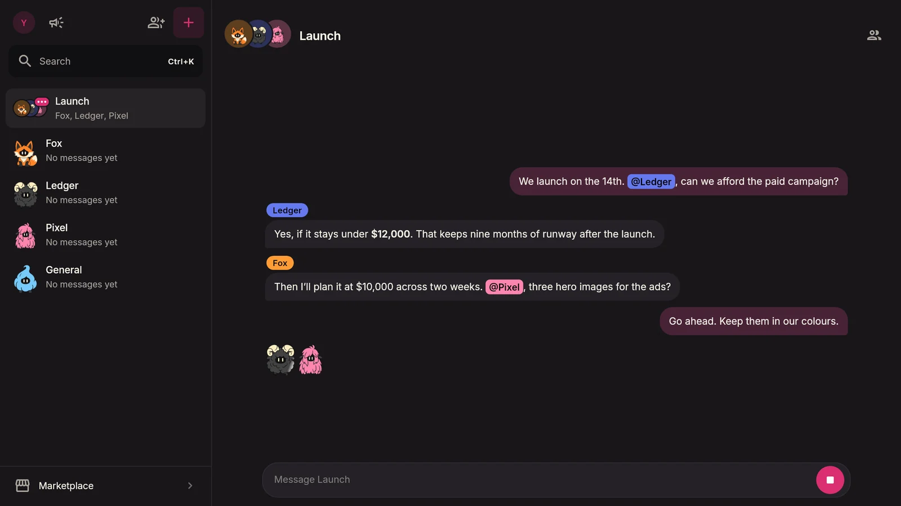

## Calls answer without a false error

fix

Asking for something on a call no longer shows “I couldn’t get that answer out loud” before the reply, and a goodbye or hand-over is heard in full.

## Unread that keeps up

fix

A reply landing in the chat you have open no longer sends an alert, and Mark unread stays until you open the Bot again. On a Mac, the Dock badge updates while the window is minimised.

## Voice replies play smoothly

fix

A Bot’s voice no longer breaks up mid-word when the connection is uneven.

## A message sent mid-reply steers the Bot

improvement

It waits in the thread, and the Bot reads it at its next step instead of dropping what it was doing.

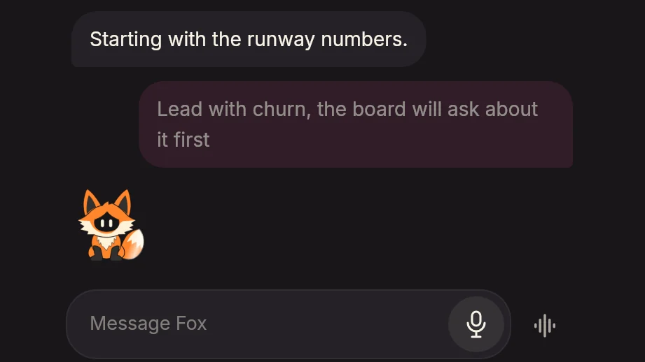

## A paused call keeps the Bot’s colour

fix

A Bot’s character no longer turns back to its original colour while a call is paused.

## Profile names the release

fix

The version at the foot of the page is the release that is running. The Mac app no longer calls itself a development build.

## Chat notices sit under the header

fix

Offline, paused and out-of-credit notices are no longer hidden behind it, and Reconnect and Open Billing can be pressed.

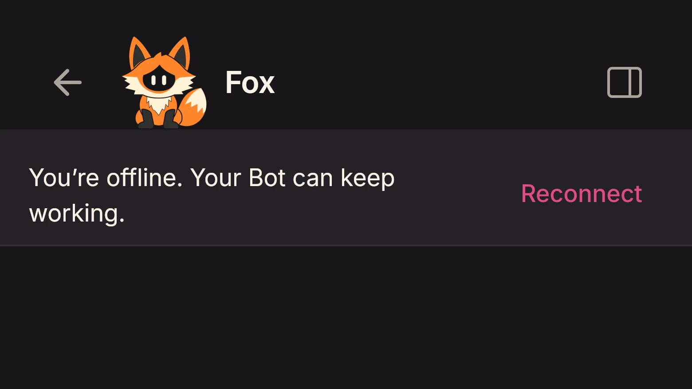

## What’s New, easier to read

improvement

Changes share a card under their day, and a wide window keeps the page to a reading width.

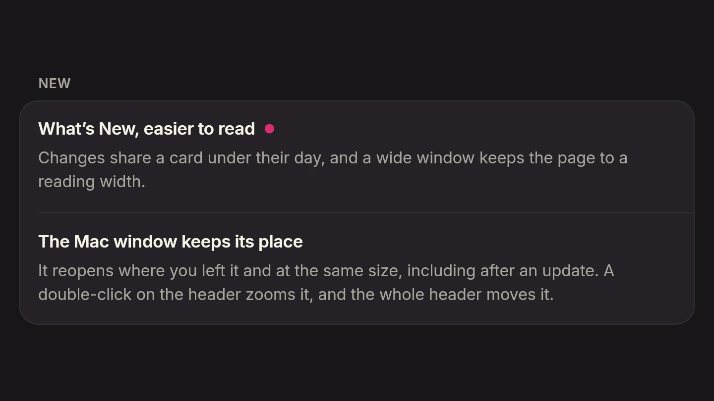

## A working Bot sits at the end of the thread

improvement

A sheen crosses it while it works. A Bot it has asked something joins it once it starts on the answer.

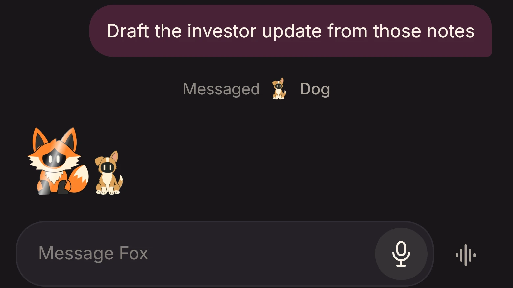

## Stop is /stop

improvement

The Stop button is gone from the chat. /stop ends what the Bot is doing.

## The Mac window keeps its place

fix

It reopens where you left it and at the same size, including after an update. A double-click on the header zooms it, and the whole header moves it.

## Avatars open in their own colour

fix

A Bot’s character no longer flashes its original colour when a screen opens.

## Colours from the characters

improvement

The pink, the creams and the black come from the characters. Your messages on Paper sit in a soft tint.

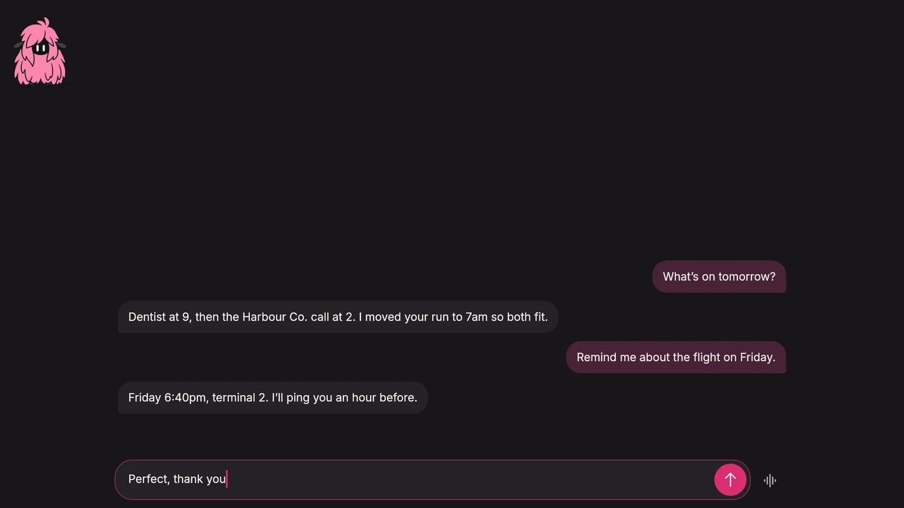

## One card per model provider

improvement

A provider that takes a key or a sign-in is one card in the Marketplace, with both ways to connect.

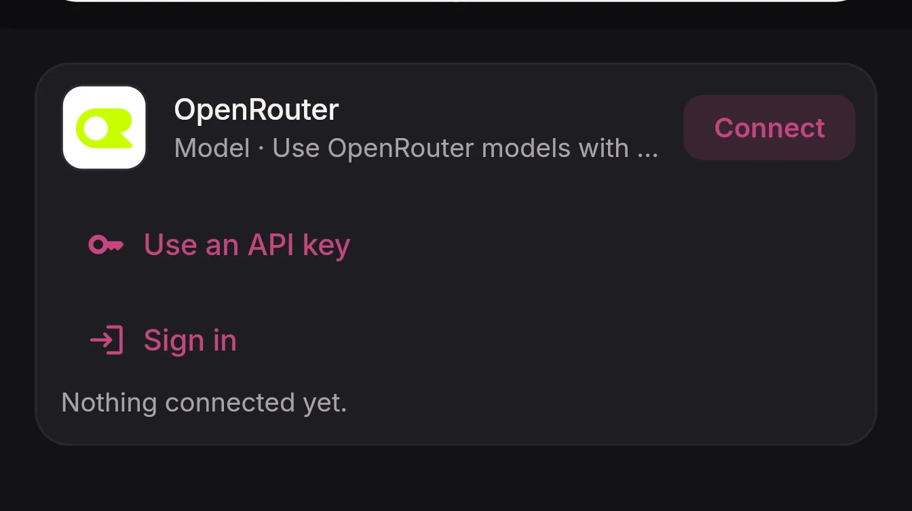

## Add a model in one go

improvement

Adding a provider in the Marketplace asks for its key straight away, then leads on to choosing a model.

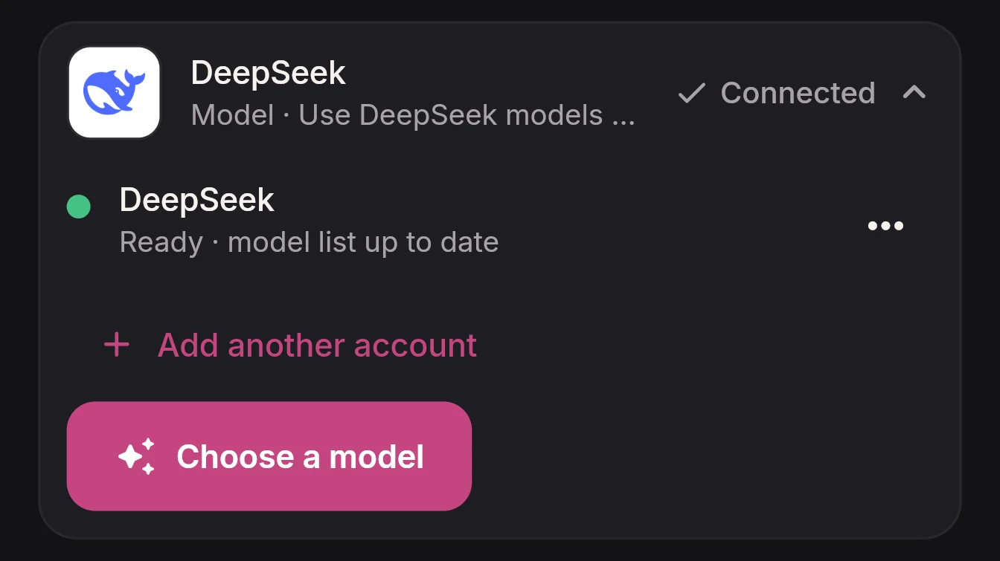

## Plugins live with each Bot

improvement

Built-in features are switched on a Bot’s own Plugins page, and every Bot can choose its own model. Account features is gone.

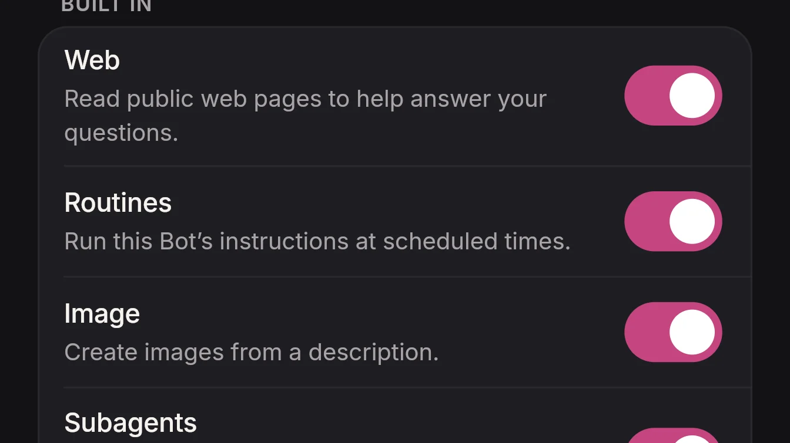

## A refused plugin theme is reported

fix

The notice names the plugin and why its theme was refused. The Bot keeps its last theme.

## The first words of a call are kept

improvement

Speech at the start of a call is held until the line is ready, then sent in order.

## Replies land as they are sent

improvement

A Bot’s message appears in the thread as soon as it is committed, without waiting for a refresh.

## A live call is a card

improvement

It sits at the top of the chat, with mute and hang-up under the wave.

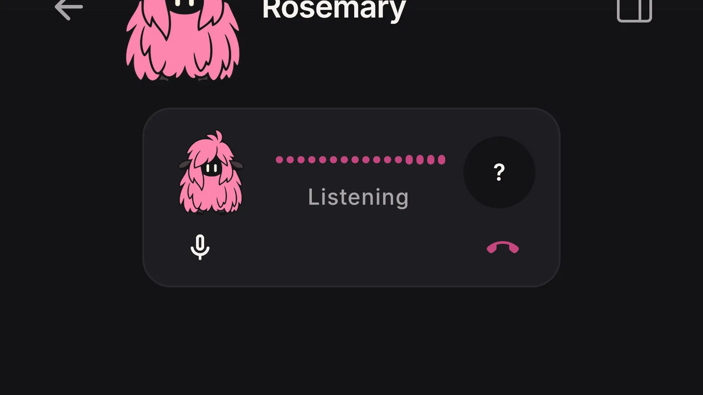

## Chat header lines up

fix

The back arrow, avatar, name, and panel icon share one center.

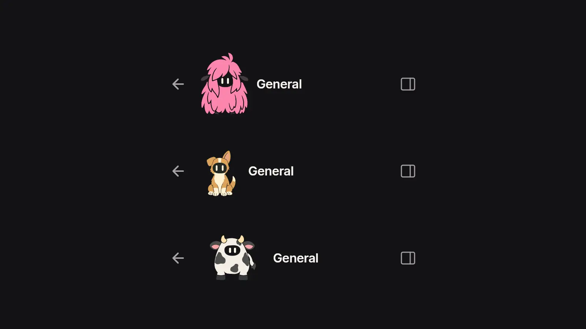

## Sends acknowledge immediately

fix

A message is accepted as soon as it is saved. A long reply no longer looks like the send failed.

## Earlier messages stay in reach

fix

A long conversation scrolls back to them, and the scrollbar holds its place.

## Installed in the Marketplace

improvement

Configure or remove added models and connectors from Installed. Models and Connectors are checkboxes under search.

## Easier reading in chat

improvement

Messages use Inter at 14, with more air between list items.

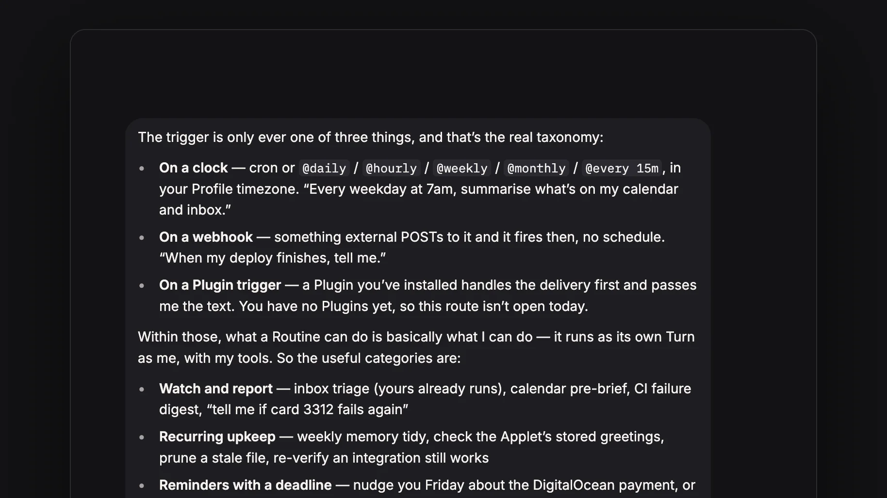

## What’s New in the app

feature

What landed in each release.

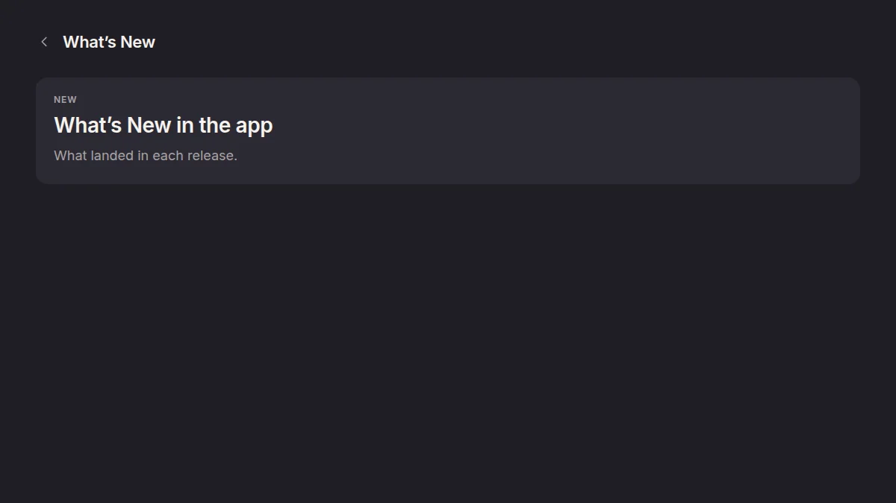
