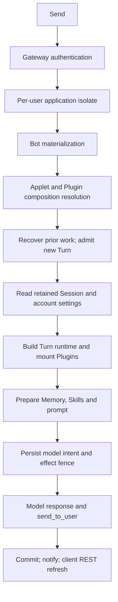
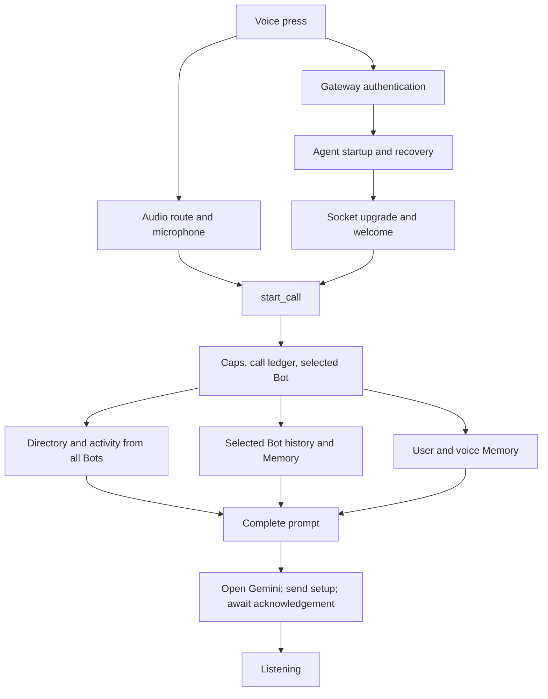

# Chat and voice startup assessment

Research date: 2026-09-22. Initial source checkout: `0d2c2d3b457ce26468e3bd4a6e9db35b5e02b17c`. Rebased and reviewed against `origin/main` at `4a1bdd9ea7b0c74e60cfced0ae6e4d7fd98b8a8a`; see [final checks and rebase](#final-checks-and-rebase).

Scope: investigate the current implementation and architectural alternatives for discussion. No product code, dependencies, deployed state, or provider settings were changed. No live model calls were made. The checkout was inspected; its identity with the currently deployed backend and installed clients was not established.

## Agreed changes — deferred until the walkthrough is complete

Tim has chosen to work through the startup paths before implementation; no further startup measurement is requested for this walkthrough. The interactive maps describe the initial checkout; the [upstream overlap review](startup-upstream-voice-overlap.md) records later voice changes. Their underlying HTML/specification artifacts have been preserved.

Memory requirements clarified during the walkthrough: retrieval must be fast and economical in model tokens, load pertinent memories, and reliably recover existing memories when needed. A small cached prompt alone does not satisfy these requirements. The [Hermes assessment](hermes-memory-assessment.md) and [provider comparison](hermes-memory-alternatives.md) informed the agreed Hindsight reference design below; physical topology and detailed mechanisms remain for design.

Recall must also remain available throughout a Turn: later model steps or tool results can reveal a need for memory that was not apparent from the initial User message. An initial decision to skip recall must not disable subsequent automatic checks or explicit Bot requests. The [Memory proposal](memory-proposal/README.md#recall-throughout-a-turn) records the proposed mechanism; implementation remains deferred.

1. **Remove the all-Bot fan-out from voice startup.** Extend the existing User-owned Bot directory with current names and descriptions, kept in sync when Bot profiles change, following the existing avatar/voice mirror pattern. Reuse the directory already read during call admission to populate the opening prompt. Fetch live activity on demand through `list_bots`, rather than querying every Bot's recent runs before opening Gemini. This removes the map's **Query every Bot** branch from startup; selected-Bot identity, history and Memory reads remain. Decision recorded only; implementation is deferred.
2. **Build shared long-term Memory using Hindsight as the reference design.** Implement it on FrockBot's Cloudflare architecture with User, Bot and Group Chat scopes, evidence-backed observations and generated topic pages, bounded recall and a small prepared startup core. Working context, compaction and original conversation history remain separate. The [Memory plan](../plan.md#planned-shared-long-term-memory-following-hindsight) records the decision and unresolved implementation details; implementation is deferred.
3. **Load bounded conversation context while preserving prompt-cache reuse.** Maintain a durable working-context projection, use bounded voice history/continuity reads, and keep original history and active recovery independently accessible. Preserve equivalent model-facing context and stable prefixes, avoid introducing a per-Turn sliding last-N window, and retain Gemini Live resumption. The [conversation-context plan](../plan.md#planned-bounded-conversation-context-with-prompt-cache-preservation) records the agreed requirements; implementation is deferred.
4. **Separate fast startup/admission from durable background recovery.** Keep immediate ownership, allowance and effect safeguards bounded; record old-call finalization and transcript-delivery obligations before replacement; drain historical work through durable scheduled batches. Add a transcript outbox with keyed retries and protected source, and admit new chat intentions before resuming old execution. Keep the existing DO authorities and voice SDK scheduler. The [recovery plan](../plan.md#planned-fast-startup-with-durable-background-recovery) records the agreed boundary and acceptance checks; implementation is deferred.
5. **Reuse prepared configuration, Skills and tool catalogs across Turns.** Share revisioned preparation inputs, maintain durable Skill metadata and Connection-scoped tool catalogs, pin schemas at first disclosure, and refresh/discover integrations outside unrelated chat startup. Preserve live authority, fresh Turn state, deterministic assembly and prompt caching. Prefer SDK client reuse for actual MCP within the separately planned Plugin work; apply the catalog pattern to Composio REST first. The [preparation plan](../plan.md#planned-reusable-runtime-preparation-and-persistent-tool-catalogs) records the decision; implementation is deferred.
6. **Unify voice session opening, buffering, cancellation and resumption.** Prepare context and establish Gemini's transport concurrently after safe admission, buffer speech until the current attempt is ready, and bound/cancel the entire opening lifecycle. Preserve resumption state across transient disconnects with bounded rejoin and ledger-continuity fallback, retaining effect safeguards. The [voice session plan](../plan.md#planned-fast-and-reliable-voice-session-opening) records the decision; implementation is deferred.
7. **Deliver committed chat updates directly over the existing socket.** Push visible messages and targeted state/card updates from a durable publication record, with bounded replay, snapshot/cursor synchronization and client deduplication. Remove per-reply transcript fetches, broad refreshes caused by private output and the duplicate initial page read. Preserve the explicit-send contract and cloud authority. The [chat delivery plan](../plan.md#planned-direct-delivery-of-committed-chat-updates) records the decision; implementation is deferred.

## Assessment

**Keep Durable Objects as the authority, but make starting a conversation require a small, bounded amount of work. Evaluate the Agents SDK as an implementation choice within that design.**

The chat Bot extends the platform `DurableObject` and delegates to a custom durable execution engine. Voice already extends Cloudflare's `Agent`, pinned to `agents@0.23.0`. It uses a custom Gemini Live bridge and ledger. Thus “use the Agents SDK” is already true for voice, and is not by itself a startup improvement.

The most consequential findings are:

1. Voice prepares live identity/activity information from **every Bot in the account**, although a call addresses one Bot. An unrelated cold or busy Bot becomes a startup dependency.
2. The installed SDK waits for voice `onStart` before accepting the WebSocket. That hook includes historical recovery, scans, scheduling and cross-Bot deliveries.
3. Chat admission reads the complete retained Session event log, including exact historical model-request payloads, before executing the new Turn. A local probe confirmed this scales with historical payload size.
4. Chat repeatedly resolves account configuration and builds fresh runtime/context state. Independent Memory and Skill preparation is embedded in an ordered hook chain.
5. Showing a chat reply requires a committed send, a throttled invalidation notice, and a REST re-read. Provider first-token time alone does not measure what the person experiences.

These are dependency and data-access problems. Changing the superclass while retaining them would retain the work. Their production latency contributions are unquantified; further measurement is not a prerequisite for the agreed design work.

## Memory architecture examined during the walkthrough

These are current-code findings for discussion, not additional implementation decisions.

- **Bot/User/Project Memory is file-backed.** The canonical Markdown bodies live in R2 through `WorkspaceFilesV1`; the Bot and User Durable Objects track their generations. Bot Memory belongs to one Bot. User and Project Memory use one shard per writing Bot, with `profile.md` and monthly log files. Reading these roots does not wake a Computer. See [roots](../../app/memory/roots.ts), [host wiring](../../app/shell/backend-memory.ts) and [object storage](../../core/workspace-store/store.ts).
- **Chat writes selected facts through tools.** `memory_write` chooses Bot/User/Project scope and profile/log/note tier. `memory_forget` removes owned facts and records retractions for other writers' shared facts. The chat Memory subsystem has no general episodic summarizer; conversation history and compaction are separate from these curated facts. See [tools](../../app/memory/agent.ts#L743), [forgetting](../../app/memory/store.ts#L495) and [episode marker](../../app/memory/facts.ts#L30).
- **Chat rebuilds prompt Memory at the first step of every Turn.** It reads Bot Memory, User Memory and every joined Project in parallel with a shared concurrency limit. Each root is bounded to eight listing pages and 64 files, then decoded and merged. Rendering applies smaller fact/character budgets, a three-Project injection cap and a 12,000-character total budget. The exact injected facts and source generations are durably recorded. This bounds output more tightly than retrieval. See [refresh](../../app/memory/agent.ts#L255), [reader](../../app/memory/store.ts#L246) and [rendering](../../app/memory/render.ts).
- **Search is separate from automatic prompt injection.** The first `memory_search` builds a derived index, reusing the Turn's decoded documents when complete. The library supports embeddings and Vectorize, but this checkout's `createBotMemoryHost` passes neither an embedder/AI binding nor Vectorize into the Memory feature. The hosted search path therefore uses lexical matching. A vector-ID ledger alone does not enable vector search. See [host](../../app/shell/backend-memory.ts#L62), [embedder selection](../../app/memory/agent.ts#L583) and [search](../../app/memory/searcher.ts).
- **Voice reads shared Memory and also owns a separate account-wide store.** At call preparation it reads selected-Bot and User Memory; Project Memory is available through `recall_project`. Its own `remember`/`forget` tools update structured records in the voice Durable Object: durable facts/preferences, ongoing items and recent continuity. A scheduled model call extracts further updates after a call ends. Those writes do not automatically populate Bot/User Memory. Call transcripts are separately delivered into Bot conversation history. See [voice writes](../../apps/cloudflare/src/voice-assistant.ts#L2574), [finalization](../../apps/cloudflare/src/voice-assistant.ts#L1092) and [voice records](../../app/voice/memory.ts).

The design question is how to keep a small, current prompt view and useful on-demand retrieval, while preserving provenance, scope and corrections. The separate voice/chat write paths also need an explicit product decision about which facts should carry across modes. Markdown storage alone does not settle either question.

## Startup milestones

Separate these milestones rather than reporting one ambiguous latency:

| Experience           | Start                         | Finish                                               |
| -------------------- | ----------------------------- | ---------------------------------------------------- |
| Open chat            | Tap/select Bot                | Cached/live conversation visible and composer usable |
| Submit chat          | Send press                    | Server durably admits the command                    |
| Start chat execution | Send press                    | First provider request dispatched                    |
| Receive chat         | Send press                    | First real user-visible send rendered                |
| Start voice          | Voice press                   | Mic and upstream ready to accept speech              |
| Receive voice        | End of the person's utterance | First output audio received / fed to player          |

Distinguish cold-after-idle, warm, reconnect, previous-work-in-flight and large-history paths in the design. A displayed status is not first audio, and a WebSocket 101 is not upstream readiness. Native playback diagnostics do not establish when sound becomes audible in the room. These distinctions do not request new timing runs.

The Flutter chat controller already restores cached rows and enables sending after restoring local pending state, before its network refresh completes. Voice already shows its UI synchronously and overlaps client socket opening with audio route/microphone work. Those improvements should be preserved. Sources: [chat controller](../../apps/native/lib/client/chat_controller.dart#L239), [voice controller](../../apps/native/lib/voice/assistant.dart#L341), [diagnostic semantics](../voice.md#timing-a-slow-call-opt-in).

## Current chat path



The diagram groups related work; several groups contain their own parallel reads. Sources: [gateway](../../apps/cloudflare/src/gateway.ts#L503), [Bot entry](../../apps/cloudflare/src/bot-state.ts#L1681), [Turn preparation](../../app/shell/turn.ts#L102), [authority](../../core/durable/authority.ts#L302), [runtime mount](../../app/shell/runtime-mount.ts#L183), [model dispatch](../../core/agent-loop/model-request.ts#L116).

### Historical payload hydration is on the admission path

`acceptRun` calls `SessionEventLog.migrate` inside its transaction. For an already paged Session, that calls `read`, which visits all retained pages and hydrates every cut payload, checks its digest, parses it and decodes it. That includes full past `model/request` events, not only user messages and tool results needed to prepare the next request.

The code already has more selective readers for display and ranges, and flushes avoid fetching payloads from earlier Turns. **Admission still takes the full-read path.** Conversation compaction appends a summary event and narrows the model's message window after the log has been loaded; it does not remove this admission read of the summarized history. Cost follows the retained session log, including old exact requests, rather than only the current prompt window. Sources: [summary persistence](../../app/shell/compaction.ts#L545), [message window](../../app/shell/history.ts#L172), [full-history derivation contract](../../core/contracts/turn-history.ts#L1).

Sources: [admission](../../core/durable/authority.ts#L1518), [migrate](../../core/durable/session-event-log.ts#L598), [full reader](../../core/durable/session-event-log.ts#L290), [payload hydration](../../core/durable/session-event-log.ts#L727), [existing flush test](../../core/durable/session-flush-reads.test.ts).

A temporary probe exercised the real `BotDurableAuthority.run` against the existing in-memory storage fixture. It seeded valid completed Turns, each with a fixed 80,000-character ASCII system prompt, then counted storage reads until the next `executeTurn` hook was reached:

| Prior Turns | Historical payload chunk reads before execution | Historical payload bytes read |
| ----------: | ----------------------------------------------: | ----------------------------: |
|           0 |                                               0 |                             0 |
|           1 |                                               3 |                        80,221 |
|          20 |                                              60 |                     1,604,467 |
|         100 |                                             300 |                     8,022,469 |

This proves the access pattern, not Cloudflare storage latency or real-world response time. The probe excludes gateway, runtime mounting, R2, billing and the provider. It is reproducible in this workspace with `bun /private/tmp/frockbot-admission-probe.ts`; the script is a temporary research artifact, not a product test.

**Architectural opportunity:** separate the immutable audit journal from the bounded working conversation. Admit against small run/queue records, then load a materialized prompt view plus its recent tail. Retain exact past requests for audit and active-request recovery, loading them by ID when needed. This preserves reconstructibility without requiring the next greeting to hydrate old prompts. Enforce bounds at retrieval, not only after constructing a large in-memory array.

### Repeated preparation before the model

Every `BotState.materialized` obtains registration from the User object and enters Bot settings/lifecycle materialization. Admission resolves Bot settings and User configuration; `agentRuntime` then reads User configuration again. It also projects the routine timezone and resolves feature/connection gates before mounting the Turn runtime.

Sources: [materialization](../../apps/cloudflare/src/bot-state.ts#L1099), [registration RPC](../../apps/cloudflare/src/bot-state.ts#L855), [admission settings](../../app/shell/turn.ts#L532), [execution context](../../app/settings/bot.ts#L739), [runtime configuration](../../app/shell/runtime-mount.ts#L221).

Some reads are already correctly parallelized: account configuration with local Plugin enablement, several feature gates, and Memory tiers/files. However, Memory refresh and Skill catalog refresh each await their own work before calling the next hook, so those preparations form stages in the ordered hook chain. The current Turn builds and disposes its runtime; resident instances of those projections do not provide a cross-Turn context cache.

Sources: [Memory preparation](../../app/memory/agent.ts#L255), [Memory hook](../../app/memory/agent.ts#L1397), [Skills hook](../../app/skills/agent.ts#L875), [hook composition](../../core/contracts/loop-hooks.ts#L165), [runtime construction](../../app/shell/backend-composition.ts#L234).

**Architectural opportunity:** one revisioned preparation snapshot per Turn, shared by admission and runtime, plus reusable immutable context keyed by source generations. Read independent context concurrently, then apply ordered hooks to those prepared values. Keep per-Turn authority, secrets/leases, effect admission and mutable runtime state separate; caching an entire live runtime indiscriminately would be unsafe. Recheck admission-sensitive revisions when committing rather than accepting stale grants.

`recoverActiveRun` can also resume old work inline before the incoming command is admitted. That matters after eviction, especially when the new message is intended to supersede prior work. A bounded durable ingress operation could record the new command and its supersede intent first, then let the execution scheduler reconcile/promote work. This requires care around existing ordering and idempotency guarantees; returning a quick receipt alone does not make the first answer faster. Source: [authority.run](../../core/durable/authority.ts#L302).

### Runtime and prompt preparation: walkthrough findings

Examined after agreeing the recovery boundary. The preparation design is now agreed in the [plan](../plan.md#planned-reusable-runtime-preparation-and-persistent-tool-catalogs); implementation remains deferred until the walkthrough is complete.

The [runtime preparation design](runtime-preparation-proposal.md) specifies ownership, Skill indexes, persistent tool catalogs, first-use schema pinning and the SDK MCP comparison. The MCP review confirms that its cross-Turn connection ownership is relevant prior art, while cold restoration still needs a durable catalog boundary for our startup requirements.

**Repeated account reads and independent snapshots.** `resolveAdmissionSnapshot` calls `resolveExecutionContextV1`, which reads Bot settings and then User configuration and resolves an execution plan, but returns only the settings. `agentRuntime` reads User configuration again and resolves the execution plan again. Applet composition preparation, composition synchronization and Skill Plugin-roster resolution also reach the User authority. Some are different records rather than duplicates, but the account-owned inputs could be gathered together with their revisions. The current runtime already shares one account-feature read across its Applet, Plugin-authoring and Skills gates and reads User configuration in parallel with Bot Plugin enablement; preserve those improvements. Sources: [admission](../../app/shell/turn.ts#L532), [execution context](../../app/settings/bot.ts#L739), [runtime](../../app/shell/runtime-mount.ts#L221), [Applet preparation](../../app/applets-host/bot.ts#L440), [composition synchronization](../../app/composition/bot.ts#L84).

There is also a consistency concern: the Skills host obtains Plugin Skills through `readBotPluginRosterV1`, which reads the User's **current** composition and reads Bot enablement again. The actual runtime mounts the Turn's **pinned** composition and its separately captured enablement. A composition change during preparation, or recovery of an older Turn, can therefore make the Skill roster describe a different Plugin set from the one mounted. This is a source-level race, not a reproduced production incident. Resolve Skills against the generation and enablement the Turn actually mounts, including any fallback generation. Sources: [Skills gate](../../app/skills/bot.ts#L137), [current roster](../../app/plugins/worker-bot.ts#L33), [pinned mount](../../app/shell/turn.ts#L273).

**Skills disclose bodies lazily to the model, but read them eagerly from storage.** At the first step, each new catalog lists the Bot and User instruction roots and fetches/parses eligible `SKILL.md` bodies up to its bounds. The prompt then contains only names, descriptions, references and attribution; bodies enter model context only when invoked or loaded. The body reads are concurrent within a limit, and reference-file contents are already loaded on demand. A maintained, versioned catalog of metadata, validation results and exact source references could remove repeated listing/body parsing. Validate that projection on every write route, deletion and authority change; retain the existing refusals, source attribution, limits and per-Turn journal record. Full bodies can be cached by immutable identity or loaded when needed, with exact-generation checks and explicit failure if the admitted version cannot be served. Sources: [refresh/journal](../../app/skills/agent.ts#L171), [catalog listing](../../app/skills/catalog.ts#L392), [body reads](../../app/skills/catalog.ts#L596), [parallel roots](../../app/skills/catalog.ts#L836), [prompt](../../app/skills/catalog.ts#L895).

**Connected-app tool discovery is an external dependency of ordinary chat.** `createConnectFeature` calls Composio's `listImportantTools` when a Turn has no existing catalog pin. The pin is keyed by Turn and Connection: it protects recovery of that Turn but the next Turn fetches again. Feature mounting awaits each feature in order, so several connected apps introduce sequential catalog fetches before the model runs. A greeting pays that preparation even if it never uses an app. This is separate from executing an external tool; the catalog read itself is discovery. Sources: [Connect mount](../../app/connect/agent.ts#L93), [Composio lookup](../../app/connect/composio.ts#L288), [pin](../../app/shell/tool-catalog-pin.ts#L149), [ordered mounting](../../core/contracts/runtime-feature.ts#L36).

The agreed direction is a prepared tool catalog refreshed on connection/setup changes and through scheduled refresh, pinned to a concrete version at first schema disclosure. On a cache miss, fetch when tool discovery is needed instead of delaying an unrelated reply, and make unavailable tools explicit. Keep Connection authorization and effect admission separate from cached schemas. This intentionally changes the current contract of fetching provider schemas for every new Turn; the design records bounded first-use refresh and explicit failure, while per-adapter refresh intervals, maximum ages and deadlines remain implementation details. Parallelize independent reads while preserving deterministic registration order. Never parallelize registry mutations or hook execution indiscriminately.

**Independent preparation is embedded inside ordered execution.** Memory and Skills each await loading and journal flushes before their `preStep` hook calls `next`. Ordered hooks are intentional, but independent source reads need not inherit that order. Prepare immutable inputs concurrently, then register contributions, apply prompt patches and write journal events in the existing deterministic order. The agreed Memory redesign supplies a prepared core; Skill and tool preparation should use the same separation of reading from applying. Keep errors attributed to the right source and preserve the current treatment of explicitly invoked Skills. Sources: [Memory hook](../../app/memory/agent.ts#L1397), [Skills hook](../../app/skills/agent.ts#L875), [hook composition](../../core/contracts/loop-hooks.ts#L180).

**Some caching already exists and should remain.** Bot backend contributions are reused while the DO is resident. Plugin artifact text is cached by content hash, with built-in artifacts served from the deployment bundle; successful Plugin health declarations are cached by immutable loader identity. Artifact reads are already parallelized with bounded concurrency. The agent runtime itself is created for each Turn and disposed afterwards, or after its detached compaction settles. Fresh per-Turn state is appropriate: it includes session events, cancellation, billing, effect admission and capability bindings. Reuse pure preparation results and immutable definitions rather than retaining an entire live agent across Turns. Sources: [backend cache](../../apps/cloudflare/src/bot-state.ts#L667), [artifact cache](../../app/isolates/capabilities.ts#L326), [health cache](../../frock-compose/plugin-worker-host.ts#L150), [parallel artifact reads](../../frock-compose/plugin-worker-host.ts#L771), [disposal](../../app/shell/backend-runner.ts#L324).

**Voice has less remaining work in this particular stage.** Its prompt-context reads already run together and reuse target identity and history, apart from the directory/history/Memory issues previously agreed. `openSession` then awaits pending delegations and reads session Memory again, replacing the session value just prepared by `buildPromptContext`. Reuse the initial session snapshot if its revision is still current, or postpone that read until its single point of use. Continue refreshing on wake, resumption or handover when state may have changed; do not freeze mutable Memory for an entire call. Gemini setup remains dependent on the complete instruction; connection overlap is a separate walkthrough topic. Sources: [parallel context](../../apps/cloudflare/src/voice-assistant.ts#L3581), [session opening](../../apps/cloudflare/src/voice-assistant.ts#L1751).

**Agreed boundary:** prepare reusable Skill/tool/configuration metadata when its sources change; at admission/execution, obtain one logical revisioned preparation snapshot and bind it to fresh Turn state. A logical snapshot spans several authorities and is not magically a cross-DO transaction: retain explicit revision checks, coherent generation selection and live authorization where required. Queued or recovered Turns must retain their admitted pins while enforcing relevant revocations. Keep cold activation fast through durable prepared indexes; an in-memory cache alone disappears on eviction. Preserve prompt order/content and avoid new dynamic prefixes so these storage changes remain compatible with the agreed prompt-cache requirements.

Cloudflare prior art: the current [Agent Skills documentation](https://developers.cloudflare.com/agents/runtime/execution/agent-skills/) describes experimental, framework-agnostic `agents/skills`, with catalogs and on-demand instructions/resources plus bundled and R2 sources. This is a focused component to assess without changing the Bot superclass. It does not by itself establish bounded storage reads or preserve FrockBot's source authority and pinned generations; verify its implementation and compatibility with the pinned SDK before adoption. The [SDK MCP client](https://developers.cloudflare.com/agents/model-context-protocol/apis/client-api/) manages persisted MCP connections, but the connected-app path inspected here uses Composio REST. Adopting an MCP client is not a direct fix for that path.

### Delivery and routing add work outside the loop

The REST path runs first-party application code in a Dynamic Worker keyed by User and application hash. Its code is fetched from R2 on a loader cache miss; the selected hash currently comes from the deployment's default. This is distinct from the necessary sandbox boundary for untrusted Plugins and Applets.

A compiled route or static service binding is worth comparing if independent application artifacts are no longer a product requirement. It would remove that layer's cache-miss/deployment complexity, but its latency contribution is unmeasured and it is not necessarily a remote network hop. Dynamic Workers cache by ID; do not charge an R2 fetch to every request. Sources: [routing](../../apps/cloudflare/src/gateway.ts#L503), [hash selection](../../apps/cloudflare/src/index.ts#L2749), [Cloudflare Worker Loader API](https://developers.cloudflare.com/dynamic-workers/api-reference/).

The observer socket sends invalidations, not reply content. Run notices are throttled at 250 ms, then Flutter fetches a transcript page. This can add the remainder of that interval plus a request/render cycle; it is not a fixed 250 ms delay on every send. A server-owned event stream carrying committed visible message deltas with replay cursors could reduce that work without making the client authoritative. Preserve the contract that ordinary assistant text is hidden and only authorized `send_to_user` content is shown. Sources: [notice cadence](../../apps/cloudflare/src/bot-state-channel.ts#L30), [notice dispatch](../../apps/cloudflare/src/bot-state-channel.ts#L360), [client refresh](../../apps/native/lib/client/state_channel.dart#L123).

Bot construction also runs five historical cleanup routines under `blockConcurrencyWhile`. Completed receipts make later runs small, but they still gate cold requests; any incomplete cleanup does more work. Scope this as maintenance, not an explanation for seconds of latency without measurement. Source: [constructor](../../apps/cloudflare/src/bot-state.ts#L575).

### Chat reply delivery: walkthrough findings

Examined after the voice-session decision. The direction below is now agreed in the [chat delivery plan](../plan.md#planned-direct-delivery-of-committed-chat-updates); implementation remains deferred until the walkthrough is complete. This pass inspected code and existing test coverage without running startup measurements.

**The current path is commit, invalidate, fetch, project, render.** `send_to_user` validates a complete payload, records a deduplicated `send/to-user` event and awaits its durable flush. Run-record writes trigger a broad `runs` notice. The observer socket carries only its cursor and topic; Flutter receives that notice and fetches the newest transcript page before it can render the message. The send need not wait for the whole Turn to finish, but it does wait for tool execution and commitment; streamed model text is private and is not the message being displayed. Sources: [send commitment](../../app/shell/agent.ts#L84), [tool execution](../../app/shell/agent.ts#L482), [storage observation](../../apps/cloudflare/src/bot-state-channel.ts#L279), [socket payload](../../apps/cloudflare/src/bot-state-channel.ts#L492), [client refresh](../../apps/native/lib/client/chat_controller.dart#L314), [message rendering](../../apps/native/lib/shell/transcript_model.dart#L587).

```text
Now:      committed send → throttled notice → GET transcript page → render
Proposed: committed send + durable delivery record → socket message → render
```

**The throttle adds a possible wait and serves much broader traffic than visible replies.** The first notice after an idle interval goes immediately; subsequent writes wait out the remainder of a 250 ms minimum interval. This is not a fixed 250 ms penalty on every reply. Private assistant chunks are persisted into the same run state, so they can trigger notices and page fetches without producing a visible message. Admission, status changes and terminal state also share that topic. Flutter coalesces notices received during a refresh, which helps, but each refresh still calls the general page reader. That reader selects and hydrates recent runs and currently invokes active-run recovery/liveness checks. The already agreed recovery boundary should also apply here. Sources: [throttle](../../apps/cloudflare/src/bot-state-channel.ts#L349), [private chunks](../../core/agent-loop/model-request.ts#L360), [event persistence](../../core/durable/authority.ts#L1719), [coalescing](../../apps/native/lib/client/state_channel.dart#L120), [page read](../../app/shell/reads.ts#L176).

**One broad notice can cause several additional reads.** After refreshing the transcript, `ChatController.invalidate` increments the notifier shared by mounted Cards. Every idle mounted Card reloads its own surface over REST; the notice identifies neither the changed card nor its revision. Both `runs` and `computer` events take the same client invalidation path. This creates avoidable work even when neither the transcript nor those cards changed. A targeted card revision event should identify the affected surface, retaining the existing card admission/rendering and action-revision checks. A targeted fetch is sufficient initially; embedding a safely projected card update is another implementation choice. Sources: [client frame handling](../../apps/native/lib/client/state_channel.dart#L99), [shared invalidation](../../apps/native/lib/client/chat_controller.dart#L307), [Card reload](../../apps/native/lib/cards/chat_card.dart#L148).

**Initial opening performs a page read before connecting the observer.** `BotSession.start` awaits `controller.initialize`, which restores local state and fetches a page, before opening its socket. With no saved channel cursor, the server sends an initial reset; that reset starts another page fetch. Existing local page caches and a pool of four Bot sessions already improve repeat visits. A snapshot and its matching stream cursor should form one synchronization boundary, avoiding the duplicate initial refresh and ensuring writes between snapshot and subscription are replayed. Merely making the two existing calls concurrent would leave that boundary unspecified. Sources: [session start](../../apps/native/lib/client/bot_sessions.dart#L26), [initial page](../../apps/native/lib/client/chat_controller.dart#L240), [initial reset](../../apps/cloudflare/src/bot-state-channel.ts#L570), [page cache](../../apps/native/lib/client/page_cache.dart#L5).

**The existing socket has useful recovery machinery, but it is an invalidation channel.** It retains 64 notices, checks cursors and explicitly resets clients outside that window; snapshot/replay and socket registration are protected against interleaving. These are useful foundations. The `runs` pending flag and throttle are resident state, and its notice is written separately from the run transaction. A failure after message commitment can therefore lose that notification without losing the message. The channel comment relies on a later poll, while the inspected native controller/channel has no periodic transcript poll: another event, explicit read or initialization may repair the view, but an immediate update is not guaranteed. This is a source-level failure window, not evidence of an observed lost reply. A payload stream must record its replayable delivery obligation with the authoritative change (or an equally durable reconstruction marker), rather than copying this advisory-notice boundary. Sources: [notice lifecycle](../../apps/cloudflare/src/bot-state-channel.ts#L349), [retention and replay](../../apps/cloudflare/src/bot-state-channel.ts#L466), [replay registration](../../apps/cloudflare/src/bot-state-channel.ts#L556), [client lifecycle](../../apps/native/lib/client/state_channel.dart), [current channel tests](../../apps/cloudflare/test/bot-state-channel.workerd.ts).

**Agreed direction: extend the current Bot observer into a stream of committed conversation updates.** Publish a small server-owned projection containing explicit messages, relevant run/status changes, announcements and targeted card revisions. Private model/tool activity must not become reply content or force a full transcript refresh. Send newly committed visible messages promptly; coalesce low-value activity updates separately. Keep one bubble per explicit send and stable identity based on the existing run/send ordinal; delivery retries must not create duplicate bubbles or alter message ordering. This changes post-commit delivery, not the model's speaking contract or when tool arguments become an authorized send.

Persist the projected update or reconstruction obligation and its monotonic cursor with the source change. The existing `eventRecords` transaction hook and post-commit `eventsCommitted` hook are candidate seams for ordinary sends; admission, terminal failures, announcements, card changes and other visible writes need equivalent coverage. Retain a bounded replay tail and explicit snapshot reset beyond it. Use the existing alarm owner to ensure unfinished publication has a durable wakeup; keep actual network delivery outside the authoritative transaction, and do not let a slow/disconnected reader block the Turn. Source: [commit hooks](../../core/durable/authority.ts#L1719).

Snapshots must identify the exact cursor they represent. Client application must tolerate duplicate delivery, reject gaps and stale revisions, and never advance a durable cursor beyond the local state recoverable after a crash. Store cache/cursor coherently or deliberately reset if the cache is missing or incomplete. Bound payload/frame sizes and replay batches; the current client's 4 KB frame cap only suits notices. Fetch older history and detailed run/audit data on demand, and use REST/snapshots for explicit reconciliation rather than every ordinary reply. Preserve authentication, Bot scoping, unread IDs, card authority, retries, cancellation and the cloud as the sole source of truth.

Acceptance should prove a committed send renders without a transcript GET, private chunks trigger no transcript/card fetch burst, only the changed card reloads, initial synchronization has no duplicate page read or race, and disconnect/eviction/rollback/gap/duplicate delivery cannot omit or duplicate committed visible messages. Include snapshot-versus-live ordering, cache/cursor persistence failure, multiple sends in a batch, background announcements, rich payload limits and terminal state. These are correctness/dependency checks with controlled inputs; no further timing study is needed for this walkthrough.

## Conversation-history loading: walkthrough findings

These findings are from code inspection, not new timing measurements. The direction and cache-preservation requirements are now agreed in the [conversation-context plan](../plan.md#planned-bounded-conversation-context-with-prompt-cache-preservation); implementation details remain for design.

- **Chat loads the journal before narrowing context.** Admission reconstructs the retained session events, including exact past model requests with their system prompts and message arrays. Those request events are not themselves replayed as conversation messages: message derivation selects user/assistant messages and tool results, then the shell applies the latest compaction summary, tool-output pruning and its history budget. This avoids confusing storage overhead with extra model input tokens. A durable working-context projection should let a new Turn read the current summary and bounded recent messages directly, while preserving sequence, active effects and exact recovery records separately. Sources: [admission](../../core/durable/authority.ts#L1518), [message derivation](../../core/contracts/turn-history.ts#L13), [request assembly](../../core/agent-loop/model-request.ts#L57), [history policy](../../app/shell/history.ts#L240).
- **Voice uses a general transcript page for a small opening excerpt.** `loadCurrentBotHistory` calls `listRuns()` with the default page, keeps the last six runs, then `renderVoiceBotHistoryV1` keeps six visible messages with at most 320 characters each and a 3,900-character result budget. The general page permits up to 32 runs, scans up to 256 index candidates when filtering, and hydrates selected run journals before projecting them. It already avoids hydrating cut model-request payloads at display fidelity, so it is not equivalent to chat's full exact-log read. The page also awaits active-run recovery before reading. A dedicated recent-conversation read should select and bound the messages at storage, and avoid unrelated execution recovery on this context-read path. Sources: [voice loader](../../apps/cloudflare/src/voice-assistant.ts#L3694), [excerpt renderer](../../app/voice/history.ts#L153), [page reader](../../app/shell/reads.ts#L176), [page limits](../../app/shell/run-protocol.ts#L156), [display fidelity](../../core/durable/session-event-log.ts#L713).
- **Voice continuity and handover bound output after broad reads.** `turnsForCall` lists all retained voice turn records and only then filters for one call. Carried continuity chooses the newest unfinished job after listing jobs, reads that call and keeps up to six turns; a session handover keeps twelve messages after reading the call. Indexing turns by call and sequence, and unfinished jobs by state/order, would let these paths read only the required tail. This is separate from semantic long-term Memory recall. Sources: [call filtering](../../app/voice/ledger.ts#L486), [carried continuity](../../app/voice/memory.ts#L1533), [handover](../../apps/cloudflare/src/voice-assistant.ts#L2457).

The design objective is bounded startup context reads even after a long conversation: a current summary plus a recent tail for text, and a compact continuity view for voice. Original history remains independently accessible by page, search or exact source reference. The agreed Hindsight-based long-term Memory design does not by itself change these conversation-loading paths.

Prompt-cache preservation constrains the projection: loading the same context from different storage need not change the provider's input. Preserve message order/content, tools and provider replay data; keep summaries stable between compactions and append within the budget. A new fixed last-N window would change the prefix every Turn and is not the selected design. Existing pruning and compaction behaviour must remain equivalent unless separately changed. Newly recalled memory should join the current work instead of causing repeated edits to the stable prefix. See [prefix caching](https://docs.x.ai/developers/advanced-api-usage/prompt-caching/how-it-works) and [changes that invalidate prefix reuse](https://docs.x.ai/developers/advanced-api-usage/prompt-caching/multi-turn). Voice also retains its separate [Live session-resumption mechanism](https://ai.google.dev/gemini-api/docs/live-api/session-management).

## Current voice path



### Voice connection and first audio: walkthrough findings

Examined after the reusable-preparation decision. The direction below is now agreed in the [voice session plan](../plan.md#planned-fast-and-reliable-voice-session-opening); implementation remains deferred until the walkthrough is complete. This pass used source inspection and official protocol documentation; no further latency measurements or live model calls were made.

**The client already overlaps connection and microphone preparation.** `start()` launches `_connect()` before awaiting the audio route and microphone. Initial unmuted/unpaused `start_call` waits for capture and the server welcome, so a microphone permission prompt does not start a metered upstream session. Main now also permits paused/muted rejoin without capture; an admitted paused call leaves Gemini closed until wake. Keep these distinctions and route-before-device ordering. The speaker is configured when `audio_config` arrives, before prompt preparation and Gemini setup finish; playback can already warm during server work. Sources: [client start](../../apps/native/lib/voice/assistant.dart#L382), [begin call](../../apps/native/lib/voice/assistant.dart#L850), [paused admission](../../apps/cloudflare/src/voice-assistant.ts#L1745), [player setup](../../apps/native/lib/voice/player.dart#L106).

**Prompt preparation and the Gemini transport handshake are unnecessarily serial.** After call admission, target resolution and release of any displaced live session, the server starts prompt reads. `openSession()` awaits those reads, pending delegations and session Memory before constructing `GeminiSessionV1`; only its `start()` opens the upstream socket. The proposed dependency change is:

```text
Now:      admission → prompt preparation → connect Gemini → setup → setupComplete
Proposed: admission → [prompt preparation || connect Gemini] → setup → setupComplete
```

The complete prompt and connection must both exist before setup is sent. Google requires setup as the first message and advises waiting for `setupComplete` before sending other messages. That permits separating transport establishment from configuration in our bridge; it does not prove an unlimited pre-setup idle window. Bound preparation/connection time, attach transport handlers immediately, and close the socket if preparation fails or the call loses ownership. This changes the dependencies without changing the completed prompt or resumption handle. Sources: [admission and preparation](../../apps/cloudflare/src/voice-assistant.ts#L1639), [open session](../../apps/cloudflare/src/voice-assistant.ts#L1751), [transport](../../apps/cloudflare/src/voice-assistant.ts#L513), [Google wire contract](https://ai.google.dev/api/live#bidigeneratecontentsetup).

**Opening audio has an uncovered interval.** The client buffers until it sends `start_call`, then immediately drains the buffer and sends live audio. The server drops audio when either the call or its session is absent. Its second buffer exists only after prompt preparation creates `GeminiSessionV1`, and then protects the socket/setup wait. Therefore audio arriving during admission or prompt preparation can be discarded. Wake has the same shape: the client sends `voice/wake` and pre-roll immediately, while the server awaits session inputs before installing a new session. This is a code-level race, not an observed production loss rate. The SDK dispatches messages independently; awaiting one handler does not serialize later events across external I/O. Sources: [client drain](../../apps/native/lib/voice/assistant.dart#L804), [client wake](../../apps/native/lib/voice/assistant.dart#L631), [server drop](../../apps/cloudflare/src/voice-assistant.ts#L1857), [session buffer](../../apps/cloudflare/src/voice-assistant.ts#L599), [SDK dispatcher](https://github.com/cloudflare/agents/blob/agents%400.23.0/packages/agents/src/websockets/websockets.ts#L126), [DO concurrency](https://developers.cloudflare.com/durable-objects/api/state/#blockconcurrencywhile).

Use one explicit readiness contract across start and wake. The agreed approach retains bounded audio on the client until the corresponding server session reports readiness, then drains it in order before live frames. Associate readiness with the current opening attempt so a stale message cannot release audio into a replacement session. Buffer overflow must produce an explicit truncation/retry outcome rather than silently losing the first words. Keep mute, pause and playback-echo filtering effective while buffering. The existing client test proves delivery after `start_call`, not end-to-end delivery through a delayed prompt. Sources: [opening-buffer test](../../apps/native/test/voice_assistant_test.dart#L98), [slow-prompt test](../../apps/cloudflare/test/voice-assistant.workerd.ts#L1662).

**Cancellation and setup failure need to belong to that same opening attempt.** There is no bridge-owned timeout for the upstream fetch or `setupComplete` wait. The client has connection/start timers, but `openSession()` does not recheck current call ownership after its prompt awaits. Closing a session already constructed is guarded; closing a call while its prompt is still loading can leave that earlier continuation free to construct a session afterward. A cancellable attempt should own preparation, the socket, setup acknowledgment and cleanup, rechecking call/session identity after each asynchronous boundary. Repeated wake/start signals should join the same attempt, and old callbacks must not clear a replacement session. Sources: [client timers](../../apps/native/lib/voice/assistant.dart#L442), [open session](../../apps/cloudflare/src/voice-assistant.ts#L1751), [release](../../apps/cloudflare/src/voice-assistant.ts#L2024), [upstream fetch](../../apps/cloudflare/src/voice-dictation.ts#L125).

**Gemini resumption exists, but only within the live in-memory call.** Sleep/wake and Gemini's `goAway` reuse the handle. A rejected handle has a fresh-session handover path. The handle itself lives on `LiveCall`; closing the client connection drops that object. Main now reconnects paused/backgrounded calls, while an ordinary live socket drop still ends the client call. The durable ledger retains a paused call for 24 hours and a live call for 60 seconds from its last-seen record; rejoining that call is different from restoring Gemini's session. The agreed direction retains a handle with its call/Bot/model identity and resumability state, and falls back to bounded ledger continuity when unusable. Google warns that resuming from an older token during generation or function execution can lose intervening state; never treat a handle as a substitute for the durable effect ledger. Sources: [upstream overlap and exact current paths](startup-upstream-voice-overlap.md), [Google resumption](https://ai.google.dev/gemini-api/docs/live-api/session-management#session-resumption), [resumability caveat](https://ai.google.dev/api/live#sessionresumptionupdate).

**The upstream handshake fixes do not close the opening-audio gap.** The client handshake completes on sending `start_call`, not server admission or Gemini setup. `status: listening` now also represents an admitted paused call with no Gemini session, so it cannot alone release buffered audio. Preserve main's pending-wake coordination, control-only reconnect to send `end_call`, asynchronous Silero preparation with fallback, and once-per-call connection chime. The [voice overlap review](startup-upstream-voice-overlap.md) lists the added acceptance cases; these have been incorporated into the existing plan.

**First reply playback already streams.** The server durably admits a response Turn before forwarding its first audio chunk, then forwards chunks without waiting for the full response. The Dart player feeds available bytes immediately, up to its in-flight limit; that limit is not a requirement to accumulate half a second before starting. Native Android output has its own buffer and silence-padded pump. Preserve durable admission and streaming; do not remove those safeguards or retune platform audio buffers merely to shorten a code path. Sources: [audio forwarding](../../apps/cloudflare/src/voice-assistant.ts#L2070), [Turn admission](../../apps/cloudflare/src/voice-assistant.ts#L2219), [player pump](../../apps/native/lib/voice/player.dart#L200), [Android speaker](../../apps/native/android/app/src/main/kotlin/com/frockbot/mobile/PcmSpeaker.kt#L51).

The recommended unit of change is a coherent session-opening lifecycle inside the existing voice Agent: safe admission, parallel preparation/transport, bounded speech buffering, readiness, cancellation and resume. Changing the DO superclass would not resolve these bridge-level dependencies. Acceptance should cover delayed prompt/transport/setup, speech immediately after Talk and Wake, cancellation at each boundary, duplicate wake signals, replacement calls, and unusable resumption handles using controlled fakes.

### The SDK still gates upgrade on recovery

The locally pinned SDK's `Lifecycle.fetch` awaits `#ensureInitialized` before handling the upgrade. Initialization awaits the host's `onStart` inside `blockConcurrencyWhile`. FrockBot's hook scans/reconciles Memory jobs, handles an old call, can deliver a transcript through Bot RPC, restores delegation checks, announces unspoken results, and schedules finalization.

The comment at `index.ts:2036` suggests bypassing `getAgentByName` avoids holding the 101 for recovery. Direct `fetch` removes the extra startup RPC, but the pinned SDK still waits for recovery. The distinction is verified in SDK source; the actual delay is workload dependent.

Sources: [FrockBot startup](../../apps/cloudflare/src/voice-assistant.ts#L887), [gateway comment](../../apps/cloudflare/src/index.ts#L2036), [SDK 0.23.0 lifecycle](https://github.com/cloudflare/agents/blob/agents%400.23.0/packages/agents/src/lifecycle/durable-object-lifecycle.ts#L515), [SDK assessment](agents-sdk-startup-assessment.md).

**Architectural opportunity:** activation should reconcile only the minimum active-call ownership and unresolved-effect state required to act safely, then arm durable recovery work. Drain unrelated transcript delivery, retention and historical jobs through bounded alarms/outboxes. Do not simply fire-and-forget existing recovery: unfinished paid effects must remain fenced and every required job must retain a durable wakeup.

### Wake-up recovery: walkthrough findings

Examined after the bounded-context decision. The recovery boundary below is now agreed in the [startup recovery plan](../plan.md#planned-fast-startup-with-durable-background-recovery); implementation remains deferred until the walkthrough is complete.

Voice's `onStart` mixes three responsibilities: restoring authority after eviction, arranging future work, and actually doing historical maintenance/delivery. It awaits them before the cold WebSocket upgrade. In order, it scans memory jobs to abandon uncertain spending, checks the current call, creates finalization work and delivers a stale call's transcript, scans unfinished jobs to protect their source turns, recovers/prunes the ledger, schedules pending delegations, announces settled answers, and scans/schedules pending memory jobs. Memory extraction itself already runs later through the scheduler; the blocking work here is its bookkeeping plus recovery, retention and delivery. Sources: [startup hook](../../apps/cloudflare/src/voice-assistant.ts#L887), [finalization callback](../../apps/cloudflare/src/voice-assistant.ts#L1092).

Several operations grow with retained records. `failUncertainJobs`, `unsummarisedJobs` and `pendingJobs` each call the all-jobs reader. `VoiceLedger.recover` lists all retained turns, marks admitted turns abandoned, deletes old/overflow turns, enumerates delegations, and prunes old meters. Creating a finalization job also calls `retireJobs`, so even the apparently small queueing step can scan completed jobs; it is reached both during startup and when a new call displaces an old one. Sources: [job scans](../../app/voice/memory.ts#L1493), [retention](../../app/voice/ledger.ts#L917), [queueing](../../apps/cloudflare/src/voice-assistant.ts#L967), [call admission](../../apps/cloudflare/src/voice-assistant.ts#L1579).

Delivery adds cross-object dependencies. A stale transcript is sent to the selected Bot, whose endpoint materializes the Bot before writing it. Announcing an unspoken delegation with no current call can also await Bot lookup and chat delivery. A new connection therefore waits on old deliveries and the destination Bot's readiness. Sources: [transcript sender](../../apps/cloudflare/src/voice-assistant.ts#L1000), [receiver](../../apps/cloudflare/src/bot-state.ts#L1792), [announcement](../../apps/cloudflare/src/voice-assistant.ts#L3076).

| Work                                                                        | Proposed placement and required guarantee                                                                                                                                                                                                         |
| --------------------------------------------------------------------------- | ------------------------------------------------------------------------------------------------------------------------------------------------------------------------------------------------------------------------------------------------- |
| Current call ownership, rejoin/replacement decision, identity and allowance | Bounded admission before opening the paid upstream session. Preserve one-call authority and admission before effects.                                                                                                                             |
| Uncertain paid work and abandoned execution                                 | Fence it before any scheduler or new execution can replay it. Track active/in-flight records directly; do not make safety depend on scanning all historical records. Deferred cleanup must not mistake new work for work from a prior activation. |
| Ending or replacing a call                                                  | Persist finalization and transcript-delivery intents before clearing/replacing its record, and ensure durable wakeups. Completing those jobs need not block the next call.                                                                        |
| Transcript/result delivery and delegation reconciliation                    | Durable, bounded scheduled work with keyed retry. Preserve prompt delivery to a live call and recovery after another eviction.                                                                                                                    |
| Memory extraction, completed-job retirement and turn/meter retention        | Background work. Preserve unsummarised and undelivered source records until their consumers finish. Index pending work instead of repeatedly enumerating the archive.                                                                             |

There is a related reliability gap in transcript delivery: the sender catches an RPC failure and only traces it; callers then clear the current-call record. The inspected paths contain no separate durable transcript-delivery retry intent. Keeping source turns is not a delivery retry mechanism. The Bot receiver already deduplicates by call ID, so a durable sender outbox can retry by that identity without creating duplicate transcript sections. Retention must protect its source until delivery succeeds. This observation concerns call transcripts; delegation announcements already have a scheduled retry path. Sources: [sender](../../apps/cloudflare/src/voice-assistant.ts#L1000), [hang-up](../../apps/cloudflare/src/voice-assistant.ts#L2003), [receiver receipt](../../apps/cloudflare/src/bot-state.ts#L1797), [delegation retry](../../apps/cloudflare/src/voice-assistant.ts#L3076).

Chat has a separate admission problem: `BotDurableAuthority.run` awaits `recoverActiveRun` before `acceptRun`. Recovery can execute the previous Turn inline, including resumed model/tool work, even though the incoming user command may want to supersede it. This occurs when interrupted or queued work needs recovery; a currently executing in-memory run is skipped. The proposed boundary is to durably admit the new command and its queue/supersede intent first, then reconcile and execute under the existing ordering and effect fences. Admission and first answer are separate milestones: safe reconciliation may still be required before the new Turn executes. This is not permission to run both Turns concurrently or repeat uncertain effects. Sources: [run](../../core/durable/authority.ts#L301), [admission and lane policy](../../core/durable/authority.ts#L1462), [recovery](../../core/durable/authority.ts#L1932).

The five historical cleanup routines in the Bot constructor also block activation. Receipts or scope checks usually make them small; incomplete applicable cleanup can scan/delete more. Retire completed one-off release cleanup after verifying its receipts, rather than accumulating it in every future activation. This is a secondary cleanup opportunity, not evidence that those checks dominate response time. Source: [constructor](../../apps/cloudflare/src/bot-state.ts#L575).

The first architecture to pursue is a small readiness/admission path plus a durable background queue within the existing objects. Voice can use its existing Agents SDK scheduler; preserve a single owner of the DO alarm. Jobs must be durably scheduled and fenced, not merely detached promises. A separate maintenance DO is not required by these findings; it would add distributed coordination and should be justified separately. Keep background batches bounded so later maintenance does not monopolize the same object's CPU/storage while a call is active. This change complements the agreed directory, Memory and bounded-context work and does not inherently alter model prompt content or cache prefixes.

### One call waits on all Bots

`buildPromptContext` awaits `listBots`. That enumerates the User directory and fetches each other Bot's identity/configuration and recent runs. Those calls enter each Bot's `materialized` path. The selected Bot reuses already fetched state, but unrelated Bots remain dependencies. `Promise.all` parallelizes the fan-out; it still waits for the slowest member. The prompt later limits the directory to 32 entries, after retrieval has happened.

Sources: [directory reads](../../apps/cloudflare/src/voice-assistant.ts#L3448), [prompt dependencies](../../apps/cloudflare/src/voice-assistant.ts#L3581), [render limit](../../app/voice/assistant.ts#L316), [Bot runs RPC](../../apps/cloudflare/src/bot-state.ts#L2936).

**Architectural opportunity:** start with the selected Bot and a compact account directory projection. Query another Bot's detailed history or fresh activity only when the conversation needs it. Name/description/activity projections should carry revision or freshness information and be updated from their owners; account ownership and grants must still be checked authoritatively. A display hint such as “working” can tolerate explicitly stale data in ways authorization cannot.

Memory/history retrieval has similar boundedness concerns: reading files or runs and then truncating the prompt does not bound the reads. Voice continuity scans jobs and filters call turns out of a wider turn collection. Add retrieval indexes and compact context views rather than merely shortening the rendered prompt. There is also a repeated session-Memory read: the initial context includes it, and `openSession` obtains it again. Freshness on resume is useful; initial setup can share one snapshot. Sources: [Memory reads](../../app/memory/store.ts#L246), [voice continuity](../../app/voice/memory.ts#L1533), [call turns](../../app/voice/ledger.ts#L486), [second session read](../../apps/cloudflare/src/voice-assistant.ts#L1776).

### Historical timings, with an important limit

Three real client diagnostic files from 2026-09-18 UTC show:

| Trace suffix | Mic ready | start_call sent | Upstream starting | Listening |
| ------------ | --------: | --------------: | ----------------: | --------: |
| bxn6Zr       |    336 ms |          362 ms |          3,312 ms |  3,978 ms |
| A50o2T       |    185 ms |          907 ms |          3,493 ms |  4,175 ms |
| ZI6ly4       |    154 ms |          315 ms |          3,690 ms |  4,340 ms |

All times use the same client clock, measured from controller start. Sending `start_call` to receiving `upstream.starting` took 2.586–3.375 s; the subsequent interval to Listening was 650–682 ms. These are client-observed intervals including transport, not isolated server spans. No first output/playback event was captured.

**These are not current performance measurements.** They predate `7907cb157` (2026-09-19, “perf: shorten text and voice response startup”), which removed repeated context reads. Later changes also affected recovery. They cannot establish that today's implementation still spends three seconds there; no new timing run is requested.

Evidence remains in `/var/folders/5m/kfvhd_k5671cqk7cdj6t08540000gn/T/frockbot-voice-timings-{bxn6Zr,A50o2T,ZI6ly4}/events.jsonl`. Only timing metadata was read. Cold/warm status and exact build are unknown. The existing [diagnostic procedure](../voice.md#timing-a-slow-call-opt-in) is retained as background, not a prerequisite for this walkthrough.

## Would extending Cloudflare Agent be better?

The completed [SDK reuse review](sdk-reuse-decision-review.md) recommends retaining the Bot superclass for this startup work and reusing the voice Agent already present. The earlier [primary-source SDK assessment](agents-sdk-startup-assessment.md) surveys broader alternatives; the table below describes their tradeoffs, not pending prerequisites.

| Approach                                                     | Benefit                                                                               | Limit / decision                                                                                                                    |
| ------------------------------------------------------------ | ------------------------------------------------------------------------------------- | ----------------------------------------------------------------------------------------------------------------------------------- |
| Keep custom Bot authority; bound context and recovery        | Directly removes demonstrated unnecessary work; preserves Turn semantics              | Retains custom scheduling/transport maintenance                                                                                     |
| Extend `Agent` while retaining the custom Turn engine        | Standard lifecycle, scheduling, connections and optional durable execution facilities | Still the same DO platform; careful alarm/connection ownership and protocol integration required                                    |
| Replace engine with `AIChatAgent` / higher-level chat stack  | More framework-owned chat persistence and streaming                                   | Broad semantic rewrite: lanes, supersede, effect fences, Plugin authority, send-only visibility, billing and Flutter protocol       |
| Split live interaction and maintenance into separate objects | Stronger isolation from housekeeping and independent lifecycles                       | Additional RPCs and distributed ownership; first show the simpler design is insufficient                                            |
| Direct client-to-provider voice                              | Could remove relay hops                                                               | Changes credential exposure, admission, metering, interruption and durable tool authority; not a drop-in fit for current invariants |

Agents are built on Durable Objects, so they do not remove storage preparation or provider handshake costs. Cloudflare's voice package is currently **Beta** and implements a transcription → `onTurn`/LLM → synthesis pipeline. It is not a replacement adapter for this app's native Gemini Live session, and choosing it would reopen the speech architecture decision. Sources: [Agents overview](https://developers.cloudflare.com/agents/), [Voice API](https://developers.cloudflare.com/agents/communication-channels/voice/).

A custom durable effect ledger is still necessary unless an alternative demonstrably provides the same semantics. Recovering a fiber or restoring a stream is not proof an external provider call happened only once. `stash` records a checkpoint; after interruption, `onFiberRecovered` lets the application decide how to proceed. The original closure is not automatically replayed. SDK adoption should preserve explicit uncertain outcomes and current effect keys. Source: [durable execution](https://developers.cloudflare.com/agents/runtime/execution/durable-execution/).

The classes are already on SQLite-backed DO namespaces, although much application state uses the async key-value API. The useful storage change would be indexed tables and bounded queries for runs, voice jobs and call turns—not simply enabling SQLite or replacing an async API with a sync one. Cloudflare distinguishes the storage backend from the API used to access it. Source: [DO storage guidance](https://developers.cloudflare.com/durable-objects/best-practices/access-durable-objects-storage/).

## Final checks and rebase

The requested rebase advanced the detached checkout by 22 commits across 53 files to `4a1bdd9ea`. There were no local commits ahead and no conflicts. All 47 existing planning/diagram files were backed up and restored byte-for-byte before these deliberate documentation updates. Runtime files have no local changes.

The three remaining checks are complete:

| Check                                                              | Finding and recommendation for discussion                                                                                                                                                                                                                                                                                                                                                                            |
| ------------------------------------------------------------------ | -------------------------------------------------------------------------------------------------------------------------------------------------------------------------------------------------------------------------------------------------------------------------------------------------------------------------------------------------------------------------------------------------------------------- |
| [Request routing](request-routing-assessment.md)                   | Ordinary REST requests load a per-User Worker containing the same first-party build for everyone. Compile the app router into the gateway while retaining Plugin/Applet isolation and release identity. Reuse one fresh auth identity per request and replace account-wide lifecycle reads with a bounded selected-Bot access result. Voice and observer sockets already bypass the app Worker.                      |
| [Model dispatch and first send](chat-model-dispatch-assessment.md) | No compulsory preliminary Jev/router inference exists. The whole provider step, response commitment and relevant settlement finish before tools run. Repeated active-run hydration and one persistence transaction per private chunk are additional candidates for bounded state and batching. Cache Radius model metadata outside routine dispatch. Keep durable intent/effect fences and complete validated sends. |
| [Concrete SDK reuse](sdk-reuse-decision-review.md)                 | Reuse voice's existing Agent scheduler/connections. Keep Bot alarm ownership, Routine policies, committed-update protocol, Skill authority and Turn/effect semantics. The full MCP manager needs a compatible durable owner and restoration adapter; the protocol client/transports Cloudflare uses are a narrower fit for the deferred Plugin work. No Bot migration or benchmark is required.                      |

These new recommendations are recorded for discussion, not silently added as agreed work. Moving accounting settlement behind a durable outbox and executing sends before a provider step finishes would need separate designs; neither is included in the existing direct-delivery decision.

Upstream changes refine acceptance rather than reverse the agreed architecture:

- [Voice rejoin](startup-upstream-voice-overlap.md) now covers paused/backgrounded calls and has separate live/paused expiry. Preserve its pending-start coordination and control-only hang-up reconnection. Opening readiness and durable Gemini resumption remain gaps.
- Native Silero classification is prepared asynchronously with fallback; the connection chime is local feedback, not a model response. Preserve both during opening changes.
- [Transcript row measurement](../../apps/native/lib/shell/transcript.dart) now improves scroll extent and bounds older-page loading. Direct delivery must preserve row identity, measured heights, focus/scroll state and pagination. It has not replaced notification-driven REST refreshes.
- The core chat loop, durable authority, preparation, SDK pin and `bun.lock` are unchanged. Profile, seeded-artifact hashing and release changes do not reverse the findings above.

The plan now incorporates these upstream compatibility constraints and the MCP ownership caveat. Existing diagrams remain snapshots of the original base, clearly labelled in their README. All implementation remains deferred.

## Recommended design to discuss

Retain one Bot authority for its ordered Turns and one per-User voice coordinator for call ownership and quotas. Give each a small startup operation:

1. **Durable admission:** authenticate, validate ownership/revisions, persist command or call intent, and keep minimal recovery fences.
2. **Bounded context:** selected identity, revisioned account configuration, a compact conversation view and generation-keyed Memory/Skill context. A shared context interface can serve chat and voice while rendering different prompts.
3. **Immediate execution/connection:** contact the model or open Live once essential context is ready. Fetch detailed history and unrelated Bot status on demand. Consider overlapping the upstream handshake with essential preparation only within an admitted call, with cleanup if preparation fails; do not assume opening paid sessions speculatively is free.
4. **Durable delivery and maintenance:** stream committed visible events; complete transcript projection, retention, indexing and unrelated recovery through durable outboxes/alarms.

A bounded context view is derived state, not a second authority. Record the exact generations a Turn used, keep invalidation durable, and distinguish data allowed to be stale from grants/credentials that must be current. Keep untrusted Plugins/Applets isolated. None of these proposals requires moving the Agent loop into Flutter.

This is a structural change to what must happen before interaction, and could be implemented with either `DurableObject` or `Agent`. My preference is to prove it with the current classes, then adopt SDK pieces where they delete meaningful machinery. A full `AIChatAgent` rewrite needs a separate case beyond startup speed.

## Correctness and dependency checks for implementation

No further startup measurements or superclass benchmark are required for this walkthrough. Use controlled inputs to verify that unrelated Bots, retained history and old recovery backlogs no longer block admission/readiness, while model-facing context and prompt-cache structure remain equivalent where policy is unchanged.

Exercise delayed preparation, provider setup and settlement; immediate speech and commands; disconnect/eviction around durable commits; replay and snapshot races; revocation, pause, replacement and uncertain effects. Each agreed section of [the plan](../plan.md) records its acceptance requirements. The new routing/dispatch reports identify additional checks if those recommendations are adopted.

The existing `reply-latency.integration.ts` checks one provider call and four initial schemas, not elapsed latency. Those are useful structural assertions, but no enforced wall-clock startup target was found there. Source: [reply test](../../apps/cloudflare/test/integration/reply-latency.integration.ts).

Verification during this investigation: the admission probe above; independent inspection of the pinned SDK lifecycle; metadata-only reading of three historical voice traces; and 12 passing existing event-log/size/flush tests (45 assertions). No live latency improvement is claimed.
